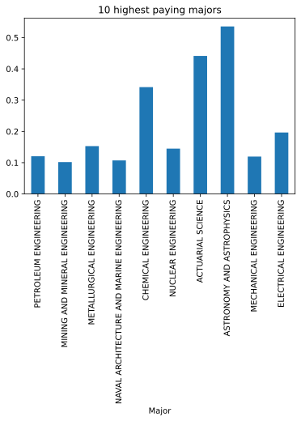

Data analysis is a process of inspecting, cleansing, transforming, and modeling data with the goal of discovering useful information, informing conclusions, and supporting decision-making. As the amount of data is growing on a daily basis, data analysis tools are currently in a high demand. Python and R are two programming languages that shine in this field. Python, espeically, is not only easy to use but also comes with countless 3rd-party libraries that facilitate the process of analysis, such as NumPy, Pandas, Matplotlib, and Seaborn. In this project, the effectiveness of these big data analysis libraries in addressing real-life social problems was studied.

&nbsp;

## Outline

[The first part of this project](#part-1-analysis-on-the-hacker-news-posts) would use nested lists and looping techniques to study posts in the Hacker News website. It would reveal the correlation between post types and user interest in Hacker News by using python.

[The second part of this project](#part-2-analysis-on-ebay-kleinanzeigen-car-sales) would employ NumPy and Pandas: the two most popular libraries for analyzing and processing tabular data. It would clean the dataset of automobiles acquired from eBay Kleinanzeigen (German eBay used-car market) and perform analysis to gain useful insight about their sales.

[The third part of this project](#part-3-analysis-on-earnings-based-on-majors) would employ Matplotlib and Seaborn to analyze people's earnings based on majors. It would visualize the trend of the dataset acquired from the American Community Survey and visualize them through various types of graphs. 

&nbsp;

## Part 1. Analysis on the Hacker News Posts

{:.lead width="400" height="400" loading="lazy"}

July 12, 2020
{:.note title="Date"}

### Dependencies
- Python 3.8

### Introduction

Below are descriptions of the columns:

- `id`: The unique identifier from Hacker News for the post
- `title`: The title of the post
- `url`: The URL that the posts links to, if the post has a URL
- `num_points`: The number of points the post acquired, calculated as the total number of upvotes minus the total number of downvotes
- `num_comments`: The number of comments that were made on the post
- `author`: The username of the person who submitted the post
- `created_at`: The date and time at which the post was submitted

The titles of some posts begin with either `Ask HN` or `Show HN`. Users submit `Ask HN` posts to ask the Hacker News community a specific question. Below are a couple examples:
>Ask HN: How to improve my personal website?
Ask HN: Am I the only one outraged by Twitter shutting down share counts?
Ask HN: Aby recent changes to CSS that broke mobile?

Likewise, users submit `Show HN` posts to show the Hacker News community a project, product, or just generally something interesting. Below are a couple of examples:
>Show HN: Wio Link  ESP8266 Based Web of Things Hardware Development Platform'
Show HN: Something pointless I made
Show HN: Shanhu.io, a programming playground powered by e8vm

These two types of posts will be compared to determine the following:
Do `Ask HN` or `Show HN` receive more comments on average?
Do posts created at a certain time receive more comments on average?

First, the necessary libraries are imported, and the data set is converted into a list of lists.


```python
# File: hacker-news-post-analysis.py
from csv import reader
hn = open('hn-2016-dataset.csv', encoding="utf-8")
hn = reader(hn)
hn = list(hn)
print(hn[:5])
```

    [['id', 'title', 'url', 'num_points', 'num_comments', 'author', 'created_at'], ['12579008', 'You have two days to comment if you want stem cells to be classified as your own', 'http://www.regulations.gov/document?D=FDA-2015-D-3719-0018', '1', '0', 'altstar', '9/26/2016 3:26'], ['12579005', 'SQLAR  the SQLite Archiver', 'https://www.sqlite.org/sqlar/doc/trunk/README.md', '1', '0', 'blacksqr', '9/26/2016 3:24'], ['12578997', 'What if we just printed a flatscreen television on the side of our boxes?', 'https://medium.com/vanmoof/our-secrets-out-f21c1f03fdc8#.ietxmez43', '1', '0', 'pavel_lishin', '9/26/2016 3:19'], ['12578989', 'algorithmic music', 'http://cacm.acm.org/magazines/2011/7/109891-algorithmic-composition/fulltext', '1', '0', 'poindontcare', '9/26/2016 3:16']]
    

### Removing Headers

When the first five rows of the data set are printed, it is found that the first list in the inner lists contains the column headers, and the lists after contain the data for one row. Thus, the row containing the column headers has to be removed.


```python
# File: hacker-news-post-analysis.py
headers = hn[1]
hn = hn[1:]
print(headers)
print(hn[:5])
```

    ['12579008', 'You have two days to comment if you want stem cells to be classified as your own', 'http://www.regulations.gov/document?D=FDA-2015-D-3719-0018', '1', '0', 'altstar', '9/26/2016 3:26']
    [['12579008', 'You have two days to comment if you want stem cells to be classified as your own', 'http://www.regulations.gov/document?D=FDA-2015-D-3719-0018', '1', '0', 'altstar', '9/26/2016 3:26'], ['12579005', 'SQLAR  the SQLite Archiver', 'https://www.sqlite.org/sqlar/doc/trunk/README.md', '1', '0', 'blacksqr', '9/26/2016 3:24'], ['12578997', 'What if we just printed a flatscreen television on the side of our boxes?', 'https://medium.com/vanmoof/our-secrets-out-f21c1f03fdc8#.ietxmez43', '1', '0', 'pavel_lishin', '9/26/2016 3:19'], ['12578989', 'algorithmic music', 'http://cacm.acm.org/magazines/2011/7/109891-algorithmic-composition/fulltext', '1', '0', 'poindontcare', '9/26/2016 3:16'], ['12578979', 'How the Data Vault Enables the Next-Gen Data Warehouse and Data Lake', 'https://www.talend.com/blog/2016/05/12/talend-and-Â\x93the-data-vaultÂ\x94', '1', '0', 'markgainor1', '9/26/2016 3:14']]
    

### Extracting Ask HN and Show HN Posts

The posts were distributed into three different categories:
- `ask_posts`, which includes the `Ask HN` posts,
- `show_posts`, which includes the `Show HN` posts,
- `other_posts`, which includes the rest of the posts.

Then, the number of posts in each category was printed:


```python
# File: hacker-news-post-analysis.py
ask_posts = []
show_posts = []
other_posts = []

for row in hn:
    title = row[1]
    title = title.lower()
    if title.startswith("ask hn"):
        ask_posts.append(row)
    elif title.startswith("show hn"):
        show_posts.append(row)
    else:
        other_posts.append(row)

print(len(ask_posts), len(show_posts), len(other_posts))

```

    9139 10158 273822
    

### Calculating the Average Number of Comments for Each Category
Next, the average numbers of the comments in each category of posts were calculated.


```python
# File: hacker-news-post-analysis.py
total_ask_comments = 0
for row in ask_posts:
    num_comments = int(row[4])
    total_ask_comments += num_comments
avg_ask_comments = total_ask_comments / len(ask_posts)

total_show_comments = 0
for row in show_posts:
    num_comments = int(row[4])
    total_show_comments += num_comments
avg_show_comments = total_show_comments / len(show_posts)

print(avg_ask_comments)
print(avg_show_comments)
    
```

    10.393478498741656
    4.886099625910612
    

Show posts received about 10 comments per post on average, and ask posts received about 5 comments per post on average. Since ask posts are more likely to receive comments, the remaining analysis will focus on these posts.

### Finding the Amount of Ask Posts and Comments by Hour Created

The next goal is to find if ask posts created at a certain *time* are more likely to attract comments. The following steps will be used to perform this analysis:

- Calculate the amount of ask posts created in each hour of the day, along with the number of comments received.
- Then, calculate the average number of comments ask posts receive by hour created.

The first technique was used to find the amount of ask posts created per hour, along with the total amount of comments.


```python
# File: hacker-news-post-analysis.py
from datetime import *
result_list = []
for row in ask_posts:
    l = [row[6], int(row[4])]
    result_list.append(l)

counts_by_hour = {}
comments_by_hour = {}
for row in result_list:
    created_at_int = row[0]
    created_at_dt = datetime.strptime(created_at_int, "%m/%d/%Y %H:%M")
    h = created_at_dt.hour
    if h not in counts_by_hour:
        counts_by_hour[h] = 1
        comments_by_hour[h] = row[1]
    else:
        counts_by_hour[h] += 1
        comments_by_hour[h] += row[1]

```

Here, two dictionaries were created:
- `counts_by_hour`: contains the number of ask posts created during each hour of the day.
- `comments_by_hour`: contains the corresponding number of comments ask posts created at each hour received.

### Calculating the Average Number of Comments for Ask HN Posts by Hour

The two dictionaries created above were used to calculate the average number of comments for posts created during each hour of day. The printed result is a list of lists whose first elements are hours and second elements are the corresponding average number of comments.


```python
# File: hacker-news-post-analysis.py
avg_by_hour = []
for key in counts_by_hour:
    avg_comments = comments_by_hour[key] / counts_by_hour[key]
    l = [key, avg_comments]
    avg_by_hour.append(l)
print(avg_by_hour)
```

    [[2, 11.137546468401487], [1, 7.407801418439717], [22, 8.804177545691905], [21, 8.687258687258687], [19, 7.163043478260869], [17, 9.449744463373083], [15, 28.676470588235293], [14, 9.692007797270955], [13, 16.31756756756757], [11, 8.96474358974359], [10, 10.684397163120567], [9, 6.653153153153153], [7, 7.013274336283186], [3, 7.948339483394834], [23, 6.696793002915452], [20, 8.749019607843136], [16, 7.713298791018998], [8, 9.190661478599221], [0, 7.5647840531561465], [18, 7.94299674267101], [12, 12.380116959064328], [4, 9.7119341563786], [6, 6.782051282051282], [5, 8.794258373205741]]
    

### Sorting and Printing Values from a List of Lists

Since the printed result is difficult to identify the hours with the highest values, the list of lists was sorted so that it can print the five highest values in a format that is easier to read.


```python
# File: hacker-news-post-analysis.py
swap_avg_by_hour = []
for row in avg_by_hour:
    l = [row[1], row[0]]
    swap_avg_by_hour.append(l)
sorted_swap = sorted(swap_avg_by_hour, reverse = True)

print("<Top 5 Hours for Asks Posts Comments>")
for row in sorted_swap[:5]:
    form = "{}: {:.2f} average comments per post"
    time_dt = datetime.strptime(str(row[1]), "%H")
    time_str = time_dt.strftime("%H:%M")
    text = form.format(time_str, row[0])
    print(text)
```

    <Top 5 Hours for Asks Posts Comments>
    15:00: 28.68 average comments per post
    13:00: 16.32 average comments per post
    12:00: 12.38 average comments per post
    02:00: 11.14 average comments per post
    10:00: 10.68 average comments per post
    

Thus, it is apparent that creating a post at 3 p.m. ET (6 p.m. PST) has the highest chance of receiving comments. In general, Hacker News users in California interact with each other mostly in the afternoon, when most people are awake during daytime.

&nbsp;

## Part 2. Analysis on eBay Kleinanzeigen Car Sales

November 4, 2020
{:.note title="Date"}

{:.lead width="400" height="400" loading="lazy"}

### Dependencies
- Python 3.8
    - NumPy
    - Pandas

This project aims to clean the data and analyze the trend of odometers, prices, registered dates, and brands of used cars in the [eBay Kleinanzeigen (German eBay auto market)](https://www.ebay-kleinanzeigen.de/s-auto/k0). The German website was exclusively selected a target because Germany has one of the biggest car markets in the world. 

The data dictionary provided with data is as follows: 

`dateCrawled` - When this ad was first crawled. All field-values are taken from this date.

`name` - Name of the car.

`seller` - Whether the seller is private or a dealer.

`offerType` - The type of listing

`price` - The price on the ad to sell the car.

`abtest` - Whether the listing is included in an A/B test.

`vehicleType` - The vehicle Type.

`yearOfRegistration` - The year in which the car was first registered.

`gearbox` - The transmission type.

`powerPS` - The power of the car in PS.

`model` - The car model name.

`kilometer` - How many kilometers the car has driven.

`monthOfRegistration` - The month in which the car was first registered.

`fuelType` - What type of fuel the car uses.

`brand` - The brand of the car.

`notRepairedDamage` - If the car has a damage which is not yet repaired.

`dateCreated` - The date on which the eBay listing was created.

`nrOfPictures` - The number of pictures in the ad.

`postalCode` - The postal code for the location of the vehicle.

`lastSeenOnline` - When the crawler saw this ad last online.

First of all, the dataset was opened and read through `pandas` module.


```python
# imports pandas and numpy
import pandas
import numpy

# reads the dataset
autos = pandas.read_csv('autos-dataset.csv', encoding='Latin-1') 

# gains information about the dataset
autos.info()
autos.head()
```

    <class 'pandas.core.frame.DataFrame'>
    RangeIndex: 371528 entries, 0 to 371527
    Data columns (total 20 columns):
     #   Column               Non-Null Count   Dtype 
    ---  ------               --------------   ----- 
     0   dateCrawled          371528 non-null  object
     1   name                 371528 non-null  object
     2   seller               371528 non-null  object
     3   offerType            371528 non-null  object
     4   price                371528 non-null  int64 
     5   abtest               371528 non-null  object
     6   vehicleType          333659 non-null  object
     7   yearOfRegistration   371528 non-null  int64 
     8   gearbox              351319 non-null  object
     9   powerPS              371528 non-null  int64 
     10  model                351044 non-null  object
     11  kilometer            371528 non-null  int64 
     12  monthOfRegistration  371528 non-null  int64 
     13  fuelType             338142 non-null  object
     14  brand                371528 non-null  object
     15  notRepairedDamage    299468 non-null  object
     16  dateCreated          371528 non-null  object
     17  nrOfPictures         371528 non-null  int64 
     18  postalCode           371528 non-null  int64 
     19  lastSeen             371528 non-null  object
    dtypes: int64(7), object(13)
    memory usage: 56.7+ MB
    


<div>
<style scoped>
    .dataframe tbody tr th:only-of-type {
        vertical-align: middle;
    }

    .dataframe tbody tr th {
        vertical-align: top;
    }

    .dataframe thead th {
        text-align: right;
    }
</style>
<table border="1" class="dataframe">
  <thead>
    <tr style="text-align: right;">
      <th></th>
      <th>dateCrawled</th>
      <th>name</th>
      <th>seller</th>
      <th>offerType</th>
      <th>price</th>
      <th>abtest</th>
      <th>vehicleType</th>
      <th>yearOfRegistration</th>
      <th>gearbox</th>
      <th>powerPS</th>
      <th>model</th>
      <th>kilometer</th>
      <th>monthOfRegistration</th>
      <th>fuelType</th>
      <th>brand</th>
      <th>notRepairedDamage</th>
      <th>dateCreated</th>
      <th>nrOfPictures</th>
      <th>postalCode</th>
      <th>lastSeen</th>
    </tr>
  </thead>
  <tbody>
    <tr>
      <th>0</th>
      <td>2016-03-24 11:52:17</td>
      <td>Golf_3_1.6</td>
      <td>privat</td>
      <td>Angebot</td>
      <td>480</td>
      <td>test</td>
      <td>NaN</td>
      <td>1993</td>
      <td>manuell</td>
      <td>0</td>
      <td>golf</td>
      <td>150000</td>
      <td>0</td>
      <td>benzin</td>
      <td>volkswagen</td>
      <td>NaN</td>
      <td>2016-03-24 00:00:00</td>
      <td>0</td>
      <td>70435</td>
      <td>2016-04-07 03:16:57</td>
    </tr>
    <tr>
      <th>1</th>
      <td>2016-03-24 10:58:45</td>
      <td>A5_Sportback_2.7_Tdi</td>
      <td>privat</td>
      <td>Angebot</td>
      <td>18300</td>
      <td>test</td>
      <td>coupe</td>
      <td>2011</td>
      <td>manuell</td>
      <td>190</td>
      <td>NaN</td>
      <td>125000</td>
      <td>5</td>
      <td>diesel</td>
      <td>audi</td>
      <td>ja</td>
      <td>2016-03-24 00:00:00</td>
      <td>0</td>
      <td>66954</td>
      <td>2016-04-07 01:46:50</td>
    </tr>
    <tr>
      <th>2</th>
      <td>2016-03-14 12:52:21</td>
      <td>Jeep_Grand_Cherokee_"Overland"</td>
      <td>privat</td>
      <td>Angebot</td>
      <td>9800</td>
      <td>test</td>
      <td>suv</td>
      <td>2004</td>
      <td>automatik</td>
      <td>163</td>
      <td>grand</td>
      <td>125000</td>
      <td>8</td>
      <td>diesel</td>
      <td>jeep</td>
      <td>NaN</td>
      <td>2016-03-14 00:00:00</td>
      <td>0</td>
      <td>90480</td>
      <td>2016-04-05 12:47:46</td>
    </tr>
    <tr>
      <th>3</th>
      <td>2016-03-17 16:54:04</td>
      <td>GOLF_4_1_4__3TÜRER</td>
      <td>privat</td>
      <td>Angebot</td>
      <td>1500</td>
      <td>test</td>
      <td>kleinwagen</td>
      <td>2001</td>
      <td>manuell</td>
      <td>75</td>
      <td>golf</td>
      <td>150000</td>
      <td>6</td>
      <td>benzin</td>
      <td>volkswagen</td>
      <td>nein</td>
      <td>2016-03-17 00:00:00</td>
      <td>0</td>
      <td>91074</td>
      <td>2016-03-17 17:40:17</td>
    </tr>
    <tr>
      <th>4</th>
      <td>2016-03-31 17:25:20</td>
      <td>Skoda_Fabia_1.4_TDI_PD_Classic</td>
      <td>privat</td>
      <td>Angebot</td>
      <td>3600</td>
      <td>test</td>
      <td>kleinwagen</td>
      <td>2008</td>
      <td>manuell</td>
      <td>69</td>
      <td>fabia</td>
      <td>90000</td>
      <td>7</td>
      <td>diesel</td>
      <td>skoda</td>
      <td>nein</td>
      <td>2016-03-31 00:00:00</td>
      <td>0</td>
      <td>60437</td>
      <td>2016-04-06 10:17:21</td>
    </tr>
  </tbody>
</table>
</div>


### Cleaning Column Names

From `autos.info()` and `autos.head()` printed to the console, the following observations were made:
- The dataset contains 20 columns, most of which are strings.
- Some columns have null values.
- The column names use camelcase instead of Python's preferred snakecase.

The column names were converted from camelcase to snakecase, and some of the column names were reworded based on the data dictionary to be more descriptive.


```python
# File: "ebay-car-sales-analysis.py"
# prints an array of the existing column names
print(autos.columns)

# renames the columns from camelcase to snakecase
autos.rename(columns= {'dateCrawled' : 'date_crawled',
                        'vehicleType': 'vehicle_type',
                        'yearOfRegistration' : 'registration_year',
                        'monthOfRegistration': 'registration_month',
                        'fuleType': "fuel_type",
                        'notRepairedDamage': 'unrepaired_damage',
                        'dateCreated': 'ad_created',
                        'nrOfPictures': 'nr_pictures',
                        'postalCode': 'postal_code',
                        'lastSeen': 'last_seen'
                        },
                        inplace = True
            )

# prints the first 5 columns of the changed dataset
autos.head()
```

    Index(['date_crawled', 'name', 'seller', 'offerType', 'price', 'abtest',
           'vehicle_type', 'registration_year', 'gearbox', 'powerPS', 'model',
           'kilometer', 'registration_month', 'fuelType', 'brand',
           'unrepaired_damage', 'ad_created', 'nr_pictures', 'postal_code',
           'last_seen'],
          dtype='object')
    


<div>
<style scoped>
    .dataframe tbody tr th:only-of-type {
        vertical-align: middle;
    }

    .dataframe tbody tr th {
        vertical-align: top;
    }

    .dataframe thead th {
        text-align: right;
    }
</style>
<table border="1" class="dataframe">
  <thead>
    <tr style="text-align: right;">
      <th></th>
      <th>date_crawled</th>
      <th>name</th>
      <th>seller</th>
      <th>offerType</th>
      <th>price</th>
      <th>abtest</th>
      <th>vehicle_type</th>
      <th>registration_year</th>
      <th>gearbox</th>
      <th>powerPS</th>
      <th>model</th>
      <th>kilometer</th>
      <th>registration_month</th>
      <th>fuelType</th>
      <th>brand</th>
      <th>unrepaired_damage</th>
      <th>ad_created</th>
      <th>nr_pictures</th>
      <th>postal_code</th>
      <th>last_seen</th>
    </tr>
  </thead>
  <tbody>
    <tr>
      <th>0</th>
      <td>2016-03-24 11:52:17</td>
      <td>Golf_3_1.6</td>
      <td>privat</td>
      <td>Angebot</td>
      <td>480</td>
      <td>test</td>
      <td>NaN</td>
      <td>1993</td>
      <td>manuell</td>
      <td>0</td>
      <td>golf</td>
      <td>150000</td>
      <td>0</td>
      <td>benzin</td>
      <td>volkswagen</td>
      <td>NaN</td>
      <td>2016-03-24 00:00:00</td>
      <td>0</td>
      <td>70435</td>
      <td>2016-04-07 03:16:57</td>
    </tr>
    <tr>
      <th>1</th>
      <td>2016-03-24 10:58:45</td>
      <td>A5_Sportback_2.7_Tdi</td>
      <td>privat</td>
      <td>Angebot</td>
      <td>18300</td>
      <td>test</td>
      <td>coupe</td>
      <td>2011</td>
      <td>manuell</td>
      <td>190</td>
      <td>NaN</td>
      <td>125000</td>
      <td>5</td>
      <td>diesel</td>
      <td>audi</td>
      <td>ja</td>
      <td>2016-03-24 00:00:00</td>
      <td>0</td>
      <td>66954</td>
      <td>2016-04-07 01:46:50</td>
    </tr>
    <tr>
      <th>2</th>
      <td>2016-03-14 12:52:21</td>
      <td>Jeep_Grand_Cherokee_"Overland"</td>
      <td>privat</td>
      <td>Angebot</td>
      <td>9800</td>
      <td>test</td>
      <td>suv</td>
      <td>2004</td>
      <td>automatik</td>
      <td>163</td>
      <td>grand</td>
      <td>125000</td>
      <td>8</td>
      <td>diesel</td>
      <td>jeep</td>
      <td>NaN</td>
      <td>2016-03-14 00:00:00</td>
      <td>0</td>
      <td>90480</td>
      <td>2016-04-05 12:47:46</td>
    </tr>
    <tr>
      <th>3</th>
      <td>2016-03-17 16:54:04</td>
      <td>GOLF_4_1_4__3TÜRER</td>
      <td>privat</td>
      <td>Angebot</td>
      <td>1500</td>
      <td>test</td>
      <td>kleinwagen</td>
      <td>2001</td>
      <td>manuell</td>
      <td>75</td>
      <td>golf</td>
      <td>150000</td>
      <td>6</td>
      <td>benzin</td>
      <td>volkswagen</td>
      <td>nein</td>
      <td>2016-03-17 00:00:00</td>
      <td>0</td>
      <td>91074</td>
      <td>2016-03-17 17:40:17</td>
    </tr>
    <tr>
      <th>4</th>
      <td>2016-03-31 17:25:20</td>
      <td>Skoda_Fabia_1.4_TDI_PD_Classic</td>
      <td>privat</td>
      <td>Angebot</td>
      <td>3600</td>
      <td>test</td>
      <td>kleinwagen</td>
      <td>2008</td>
      <td>manuell</td>
      <td>69</td>
      <td>fabia</td>
      <td>90000</td>
      <td>7</td>
      <td>diesel</td>
      <td>skoda</td>
      <td>nein</td>
      <td>2016-03-31 00:00:00</td>
      <td>0</td>
      <td>60437</td>
      <td>2016-04-06 10:17:21</td>
    </tr>
  </tbody>
</table>
</div>


### Exploring Kilometer and Price


```python
# File: "ebay-car-sales-analysis.py"
autos["kilometer"].value_counts()
```


    150000    240797
    125000     38067
    100000     15920
    90000      12523
    80000      11053
    70000       9773
    60000       8669
    50000       7615
    5000        7069
    40000       6376
    30000       6041
    20000       5676
    10000       1949
    Name: kilometer, dtype: int64


It is clear that the values in this field were rounded, which might indicate that sellers had to choose from pre-set options for this field. Additionally, there are more high mileage than low mileage vehicles.


```python
# File: "ebay-car-sales-analysis.py"
print(autos["price"].unique().shape)
print(autos["price"].describe())
autos["price"].value_counts().head(20)
```

    (5597,)
    count    3.715280e+05
    mean     1.729514e+04
    std      3.587954e+06
    min      0.000000e+00
    25%      1.150000e+03
    50%      2.950000e+03
    75%      7.200000e+03
    max      2.147484e+09
    Name: price, dtype: float64
    


    0       10778
    500      5670
    1500     5394
    1000     4649
    1200     4594
    2500     4438
    600      3819
    3500     3792
    800      3784
    2000     3432
    999      3364
    750      3203
    650      3150
    4500     3053
    850      2946
    2200     2936
    700      2936
    1800     2886
    900      2874
    950      2793
    Name: price, dtype: int64


Again, the prices in this column seem rounded, however given there are 5597 unique values in the column, that may just be people's tendency to round prices on the site.

There are 10.778 cars listed with $0 price - given that this is only 2% of the of the cars, removing these rows must be considered. The maximum price seems extremely high, so the highest prices must be examined further.


```python
# File: "ebay-car-sales-analysis.py"
autos["price"].value_counts().sort_index(ascending=False).head(20)
```


    2147483647     1
    99999999      15
    99000000       1
    74185296       1
    32545461       1
    27322222       1
    14000500       1
    12345678       9
    11111111      10
    10010011       1
    10000000       8
    9999999        3
    3895000        1
    3890000        1
    2995000        1
    2795000        1
    1600000        2
    1300000        1
    1250000        2
    1234566        1
    Name: price, dtype: int64


```python
# File: "ebay-car-sales-analysis.py"
autos["price"].value_counts().sort_index(ascending=True).head(20)
```


    0     10778
    1      1189
    2        12
    3         8
    4         1
    5        26
    7         3
    8         9
    9         8
    10       84
    11        5
    12        8
    13        7
    14        5
    15       27
    16        2
    17        5
    18        3
    19        3
    20       51
    Name: price, dtype: int64


There are a number of listings with prices below 30 dollars, including about 10,778 at 0 dollars. There are also a small number of listings with very high values.

Given that eBay is an auction site, there could legitimately be items where the opening bid is 1. One-dollar items were kept, but anything above 350,000 dollars was removed, since it seemed that prices increase steadily to that number and then jump up to less realistic numbers.


```python
# File: "ebay-car-sales-analysis.py"
autos = autos[autos["price"].between(1,351000)]
autos["price"].describe()
```


    count    360635.000000
    mean       5898.671956
    std        8866.359669
    min           1.000000
    25%        1250.000000
    50%        3000.000000
    75%        7490.000000
    max      350000.000000
    Name: price, dtype: float64


### Exploring the date columns
There are a number of columns with date information:
- `date_crawled`
- `registration_month`
- `registration_year`
- `ad_created`
- `last_seen`
These are a combination of dates that were crawled, and dates with meta-information from the crawler. The non-registration dates are stored as strings.

Further observations are required.


```python
# File: "ebay-car-sales-analysis.py"
autos[['date_crawled','ad_created','last_seen']][0:5]
```


<div>
<style scoped>
    .dataframe tbody tr th:only-of-type {
        vertical-align: middle;
    }

    .dataframe tbody tr th {
        vertical-align: top;
    }

    .dataframe thead th {
        text-align: right;
    }
</style>
<table border="1" class="dataframe">
  <thead>
    <tr style="text-align: right;">
      <th></th>
      <th>date_crawled</th>
      <th>ad_created</th>
      <th>last_seen</th>
    </tr>
  </thead>
  <tbody>
    <tr>
      <th>0</th>
      <td>2016-03-24 11:52:17</td>
      <td>2016-03-24 00:00:00</td>
      <td>2016-04-07 03:16:57</td>
    </tr>
    <tr>
      <th>1</th>
      <td>2016-03-24 10:58:45</td>
      <td>2016-03-24 00:00:00</td>
      <td>2016-04-07 01:46:50</td>
    </tr>
    <tr>
      <th>2</th>
      <td>2016-03-14 12:52:21</td>
      <td>2016-03-14 00:00:00</td>
      <td>2016-04-05 12:47:46</td>
    </tr>
    <tr>
      <th>3</th>
      <td>2016-03-17 16:54:04</td>
      <td>2016-03-17 00:00:00</td>
      <td>2016-03-17 17:40:17</td>
    </tr>
    <tr>
      <th>4</th>
      <td>2016-03-31 17:25:20</td>
      <td>2016-03-31 00:00:00</td>
      <td>2016-04-06 10:17:21</td>
    </tr>
  </tbody>
</table>
</div>


```python
# File: "ebay-car-sales-analysis.py"
(autos["date_crawled"]
        .str[:10]
        .value_counts(normalize=True, dropna=False)
        .sort_index()
        )
```


    2016-03-05    0.025547
    2016-03-06    0.014483
    2016-03-07    0.035657
    2016-03-08    0.033469
    2016-03-09    0.034115
    2016-03-10    0.032645
    2016-03-11    0.032773
    2016-03-12    0.036242
    2016-03-13    0.015783
    2016-03-14    0.036330
    2016-03-15    0.033424
    2016-03-16    0.030205
    2016-03-17    0.031647
    2016-03-18    0.013119
    2016-03-19    0.035271
    2016-03-20    0.036400
    2016-03-21    0.035682
    2016-03-22    0.032493
    2016-03-23    0.032002
    2016-03-24    0.029914
    2016-03-25    0.032800
    2016-03-26    0.031974
    2016-03-27    0.030227
    2016-03-28    0.035063
    2016-03-29    0.034126
    2016-03-30    0.033535
    2016-03-31    0.031872
    2016-04-01    0.034145
    2016-04-02    0.035094
    2016-04-03    0.038812
    2016-04-04    0.037628
    2016-04-05    0.012780
    2016-04-06    0.003128
    2016-04-07    0.001617
    Name: date_crawled, dtype: float64


```python
# File: "ebay-car-sales-analysis.py"
(autos["date_crawled"]
        .str[:10]
        .value_counts(normalize=True, dropna=False)
        .sort_values()
        )
```


    2016-04-07    0.001617
    2016-04-06    0.003128
    2016-04-05    0.012780
    2016-03-18    0.013119
    2016-03-06    0.014483
    2016-03-13    0.015783
    2016-03-05    0.025547
    2016-03-24    0.029914
    2016-03-16    0.030205
    2016-03-27    0.030227
    2016-03-17    0.031647
    2016-03-31    0.031872
    2016-03-26    0.031974
    2016-03-23    0.032002
    2016-03-22    0.032493
    2016-03-10    0.032645
    2016-03-11    0.032773
    2016-03-25    0.032800
    2016-03-15    0.033424
    2016-03-08    0.033469
    2016-03-30    0.033535
    2016-03-09    0.034115
    2016-03-29    0.034126
    2016-04-01    0.034145
    2016-03-28    0.035063
    2016-04-02    0.035094
    2016-03-19    0.035271
    2016-03-07    0.035657
    2016-03-21    0.035682
    2016-03-12    0.036242
    2016-03-14    0.036330
    2016-03-20    0.036400
    2016-04-04    0.037628
    2016-04-03    0.038812
    Name: date_crawled, dtype: float64


```python
# File: "ebay-car-sales-analysis.py"
(autos["last_seen"]
        .str[:10]
        .value_counts(normalize=True, dropna=False)
        .sort_index()
        )
```


    2016-03-05    0.001264
    2016-03-06    0.004098
    2016-03-07    0.005202
    2016-03-08    0.007939
    2016-03-09    0.009824
    2016-03-10    0.011460
    2016-03-11    0.012955
    2016-03-12    0.023240
    2016-03-13    0.008410
    2016-03-14    0.012176
    2016-03-15    0.016324
    2016-03-16    0.016418
    2016-03-17    0.028699
    2016-03-18    0.006888
    2016-03-19    0.016330
    2016-03-20    0.019884
    2016-03-21    0.020026
    2016-03-22    0.020508
    2016-03-23    0.018015
    2016-03-24    0.019163
    2016-03-25    0.019000
    2016-03-26    0.015958
    2016-03-27    0.016721
    2016-03-28    0.022189
    2016-03-29    0.023284
    2016-03-30    0.023725
    2016-03-31    0.024243
    2016-04-01    0.023897
    2016-04-02    0.024967
    2016-04-03    0.025308
    2016-04-04    0.025536
    2016-04-05    0.126962
    2016-04-06    0.218950
    2016-04-07    0.130437
    Name: last_seen, dtype: float64


The crawler recorded the date it last saw any listing, which allows us to determine on what day a listing was removed, presumably because the car was sold.

The last three days contain a disproportionate amount of 'last seen' values. Given that these are 6-10x the values from the previous days, it's unlikely that there was a massive spike in sales, and more likely that these values are to do with the crawling period ending and don't indicate car sales.


```python
# File: "ebay-car-sales-analysis.py"
print(autos["ad_created"].str[:10].unique().shape)
(autos["ad_created"]
        .str[:10]
        .value_counts(normalize=True, dropna=False)
        .sort_index()
        )
```

    (114,)
    


    2014-03-10    0.000003
    2015-03-20    0.000003
    2015-06-11    0.000003
    2015-06-18    0.000003
    2015-08-07    0.000003
                    ...   
    2016-04-03    0.039001
    2016-04-04    0.037736
    2016-04-05    0.011613
    2016-04-06    0.003119
    2016-04-07    0.001553
    Name: ad_created, Length: 114, dtype: float64


There is a large variety of ad created dates. Most fall within 1-2 months of the listing date, but a few are quite old, with the oldest at around 9 months.


```python
# File: "ebay-car-sales-analysis.py"
autos["registration_year"].describe()
```


    count    360635.000000
    mean       2004.433133
    std          81.016977
    min        1000.000000
    25%        1999.000000
    50%        2004.000000
    75%        2008.000000
    max        9999.000000
    Name: registration_year, dtype: float64


The year that the car was first registered will likely indicate the age of the car. Looking at this column, odd values were discovered. The minimum value is 1000, long before cars were invented and the maximum is 9999, many years into the future.

### Dealing with Incorrect Registration Year Data

Because a car can't be first registered before the listing was seen, any vehicle with a registration year above 2016 is definitely inaccurate. Determining the earliest valid year is more difficult. Realistically, it could be somewhere in the first few decades of the 1900s.

One option is to remove the listings with these values.


```python
# File: "ebay-car-sales-analysis.py"
(~autos["registration_year"].between(1900,2016)).sum() / autos.shape[0]
```


    0.038751091824143526


Given that this is less than 4% of our data, these rows were removed.


```python
# File: "ebay-car-sales-analysis.py"
autos = autos[autos["registration_year"].between(1900,2016)]
autos["registration_year"].value_counts(normalize=True).head(10)
```


    2000    0.066699
    1999    0.063552
    2005    0.062669
    2006    0.057708
    2001    0.056955
    2003    0.056557
    2004    0.056173
    2002    0.054290
    2007    0.050499
    1998    0.049691
    Name: registration_year, dtype: float64


It appears that most of the vehicles were first registered in the past 20 years.

### Exploring Price by Brand


```python
# File: "ebay-car-sales-analysis.py"
autos["brand"].value_counts(normalize=True)
```


    volkswagen        0.211700
    bmw               0.109871
    opel              0.106410
    mercedes_benz     0.096841
    audi              0.089543
    ford              0.068918
    renault           0.047516
    peugeot           0.030153
    fiat              0.025691
    seat              0.018661
    skoda             0.015687
    mazda             0.015384
    smart             0.014331
    citroen           0.013950
    nissan            0.013598
    toyota            0.012932
    hyundai           0.009972
    sonstige_autos    0.009493
    mini              0.009384
    volvo             0.009147
    mitsubishi        0.008236
    honda             0.007532
    kia               0.006915
    suzuki            0.006364
    alfa_romeo        0.006309
    porsche           0.006211
    chevrolet         0.005022
    chrysler          0.003863
    dacia             0.002495
    jeep              0.002192
    land_rover        0.002166
    daihatsu          0.002161
    subaru            0.002117
    jaguar            0.001734
    saab              0.001465
    daewoo            0.001457
    trabant           0.001408
    lancia            0.001301
    rover             0.001272
    lada              0.000597
    Name: brand, dtype: float64


German manufacturers represent four out of the top five brands, almost 50% of the overall listings. Volkswagen is by far the most popular brand, with approximately double the cars for sale of the next two brands combined.

There are lots of brands that don't have a significant percentage of listings, so the analysis to brands must be limited to represent more than 5% of total listings.


```python
# File: "ebay-car-sales-analysis.py"
brand_counts = autos["brand"].value_counts(normalize=True)
common_brands = brand_counts[brand_counts > .05].index
print(common_brands)
```

    Index(['volkswagen', 'bmw', 'opel', 'mercedes_benz', 'audi', 'ford'], dtype='object')
    


```python
# File: "ebay-car-sales-analysis.py"
brand_mean_prices = {}

for brand in common_brands:
    brand_only = autos[autos["brand"] == brand]
    mean_price = brand_only["price"].mean()
    brand_mean_prices[brand] = int(mean_price)

brand_mean_prices
```


    {'volkswagen': 5400,
     'bmw': 8449,
     'opel': 2971,
     'mercedes_benz': 8551,
     'audi': 9086,
     'ford': 3696}


Of the top 5 brands, there is a distinct price gap:

Audi, BMW and Mercedes Benz are more expensive
Ford and Opel are less expensive
Volkswagen is in-between - this may explain its popularity; it may be a "best of 'both worlds'" option.

&nbsp;

## Part 3. Analysis on Earnings Based on Majors

{:.lead width="400" height="400" loading="lazy"}

December 1, 2020
{:.note title="Date"}

In this project, the pandas plotting functionality was used along with the Jupyter notebook interface to allow for the quick data quickly using visualizations. A dataset on the job outcomes of students who graduated from college was used. The original data on job outcomes was released by [American Community Survey](https://www.census.gov/programs-surveys/acs/), which conducts surveys and aggregates the data.

### Dependencies
- Python 3.8
    - NumPy, Pandas
    - Matplotlib, Seaborn 

### Introduction

Each row in the dataset represents a different major in college and contains information on gender diversity, employment rates, median salaries, and more. Here are some of the columns in the dataset:
- `Rank` - Rank by median earnings (the dataset is ordered by this column).
- `Major_code` - Major code.
- `Major` - Major description.
- `Major_category` - Category of major.
- `Total` - Total number of people with major.
- `Sample_size` - Sample size (unweighted) of full-time.
- `Men` - Male graduates.
- `Women` - Female graduates.
- `ShareWomen` - Women as share of total.
- `Employed` - Number employed.
- `Median` - Median salary of full-time, year-round workers.
- `Low_wage_jobs` - Number in low-wage service jobs.
- `Full_time` - Number employed 35 hours or more.
- `Part_time` - Number employed less than 35 hours.

Using visualizations, several questions can be answered:
- Do students in more popular majors make more money?
    - Using scatter plots
- How many majors are predominantly male? Predominantly female?
    - Using histograms
- Which category of majors have the most students?
    - Using bar plots

First, libraries were imported, and rows with null values were removed.


```python
import pandas as pd
import matplotlib.pyplot as plt
%matplotlib inline
```


```python
recent_grads = pd.read_csv('grads-dataset.csv')
print(recent_grads.iloc[0])
print(recent_grads.head())
print(recent_grads.tail())
recent_grads = recent_grads.dropna()
```

    Rank                                        1
    Major_code                               2419
    Major                   PETROLEUM ENGINEERING
    Total                                    2339
    Men                                      2057
    Women                                     282
    Major_category                    Engineering
    ShareWomen                           0.120564
    Sample_size                                36
    Employed                                 1976
    Full_time                                1849
    Part_time                                 270
    Full_time_year_round                     1207
    Unemployed                                 37
    Unemployment_rate                   0.0183805
    Median                                 110000
    P25th                                   95000
    P75th                                  125000
    College_jobs                             1534
    Non_college_jobs                          364
    Low_wage_jobs                             193
    Name: 0, dtype: object
       Rank  Major_code                                      Major    Total  \
    0     1        2419                      PETROLEUM ENGINEERING   2339.0   
    1     2        2416             MINING AND MINERAL ENGINEERING    756.0   
    2     3        2415                  METALLURGICAL ENGINEERING    856.0   
    3     4        2417  NAVAL ARCHITECTURE AND MARINE ENGINEERING   1258.0   
    4     5        2405                       CHEMICAL ENGINEERING  32260.0   
    
           Men    Women Major_category  ShareWomen  Sample_size  Employed  ...  \
    0   2057.0    282.0    Engineering    0.120564           36      1976  ...   
    1    679.0     77.0    Engineering    0.101852            7       640  ...   
    2    725.0    131.0    Engineering    0.153037            3       648  ...   
    3   1123.0    135.0    Engineering    0.107313           16       758  ...   
    4  21239.0  11021.0    Engineering    0.341631          289     25694  ...   
    
       Part_time  Full_time_year_round  Unemployed  Unemployment_rate  Median  \
    0        270                  1207          37           0.018381  110000   
    1        170                   388          85           0.117241   75000   
    2        133                   340          16           0.024096   73000   
    3        150                   692          40           0.050125   70000   
    4       5180                 16697        1672           0.061098   65000   
    
       P25th   P75th  College_jobs  Non_college_jobs  Low_wage_jobs  
    0  95000  125000          1534               364            193  
    1  55000   90000           350               257             50  
    2  50000  105000           456               176              0  
    3  43000   80000           529               102              0  
    4  50000   75000         18314              4440            972  
    
    [5 rows x 21 columns]
         Rank  Major_code                   Major   Total     Men   Women  \
    168   169        3609                 ZOOLOGY  8409.0  3050.0  5359.0   
    169   170        5201  EDUCATIONAL PSYCHOLOGY  2854.0   522.0  2332.0   
    170   171        5202     CLINICAL PSYCHOLOGY  2838.0   568.0  2270.0   
    171   172        5203   COUNSELING PSYCHOLOGY  4626.0   931.0  3695.0   
    172   173        3501         LIBRARY SCIENCE  1098.0   134.0   964.0   
    
                   Major_category  ShareWomen  Sample_size  Employed  ...  \
    168    Biology & Life Science    0.637293           47      6259  ...   
    169  Psychology & Social Work    0.817099            7      2125  ...   
    170  Psychology & Social Work    0.799859           13      2101  ...   
    171  Psychology & Social Work    0.798746           21      3777  ...   
    172                 Education    0.877960            2       742  ...   
    
         Part_time  Full_time_year_round  Unemployed  Unemployment_rate  Median  \
    168       2190                  3602         304           0.046320   26000   
    169        572                  1211         148           0.065112   25000   
    170        648                  1293         368           0.149048   25000   
    171        965                  2738         214           0.053621   23400   
    172        237                   410          87           0.104946   22000   
    
         P25th  P75th  College_jobs  Non_college_jobs  Low_wage_jobs  
    168  20000  39000          2771              2947            743  
    169  24000  34000          1488               615             82  
    170  25000  40000           986               870            622  
    171  19200  26000          2403              1245            308  
    172  20000  22000           288               338            192  
    
    [5 rows x 21 columns]
    

### Scatter Plots

Scatter plots were generated to explore the following relations:
- `Sample_size` and `Median`
- `Sample_size` and `Unemployment_rate`
- `Full_time` and `Median`
- `ShareWomen` and `Unemployment_rate`
- `Men` and `Median`
- `Women` and `Median`


```python
recent_grads.plot(x='Sample_size', y='Median', kind='scatter')
```


    <AxesSubplot:xlabel='Sample_size', ylabel='Median'>


{:.lead width="400" height="400" loading="lazy"}


```python
recent_grads.plot(x='Sample_size', y='Unemployment_rate', kind='scatter')
```


    <AxesSubplot:xlabel='Sample_size', ylabel='Unemployment_rate'>


{:.lead width="400" height="400" loading="lazy"}


```python
recent_grads.plot(x='Full_time', y='Median', kind='scatter')
```


    <AxesSubplot:xlabel='Full_time', ylabel='Median'>


{:.lead width="400" height="400" loading="lazy"}


```python
recent_grads.plot(x='ShareWomen', y='Unemployment_rate', kind='scatter')
```


    <AxesSubplot:xlabel='ShareWomen', ylabel='Unemployment_rate'>


{:.lead width="400" height="400" loading="lazy"}


```python
recent_grads.plot(x='Men', y='Median', kind='scatter')
```


    <AxesSubplot:xlabel='Men', ylabel='Median'>


{:.lead width="400" height="400" loading="lazy"}


```python
recent_grads.plot(x='Women', y='Median', kind='scatter')
```


    <AxesSubplot:xlabel='Women', ylabel='Median'>


{:.lead width="400" height="400" loading="lazy"}

__Findings__
- Students in more popular majors do not necessarily make more money.
- Students that majored in subjects that were majority female do not make more money.

### Histograms
Histograms were generated to explore the distributions of the following columns:
- `Sample_size`
- `Median`
- `Employed`
- `Full_time`
- `ShareWomen`
- `Unemployment_rate`
- `Men`
- `Women`


```python
cols = ["Sample_size", "Median", "Employed", "Full_time", "ShareWomen", "Unemployment_rate", "Men", "Women"]

fig = plt.figure(figsize=(18,10))
for r in range(0,4):
    ax = fig.add_subplot(2,2,r+1)
    ax.hist(recent_grads[cols[r]])
    ax.set_xlabel(cols[r])
```


{:.lead width="400" height="400" loading="lazy"}


```python
cols = ["Sample_size", "Median", "Employed", "Full_time", "ShareWomen", "Unemployment_rate", "Men", "Women"]

fig = plt.figure(figsize=(18,10))
for r in range(4,8):
    ax = fig.add_subplot(2,2,r-3)
    ax.hist(recent_grads[cols[r]])
    ax.set_xlabel(cols[r])
```


{:.lead width="400" height="400" loading="lazy"}


__Findings__
- Around 20 percent of majors are predominantly male.
- Around 20 percent of majors are predominantly female.
- The most commen median salary range is bettween 30000 to 40000.

### Scatter Matrix Plot
Scatter plots and histograms were combined into scatter matrix plots to reveal the further relations.


```python
from pandas.plotting import scatter_matrix
scatter_matrix(recent_grads[['Sample_size', 'Median']],
              figsize=(10,10))
```


    array([[<AxesSubplot:xlabel='Sample_size', ylabel='Sample_size'>,
            <AxesSubplot:xlabel='Median', ylabel='Sample_size'>],
           [<AxesSubplot:xlabel='Sample_size', ylabel='Median'>,
            <AxesSubplot:xlabel='Median', ylabel='Median'>]], dtype=object)


{:.lead width="400" height="400" loading="lazy"}


```python
scatter_matrix(recent_grads[['Sample_size', 'Median', 'Unemployment_rate']],
              figsize=(10,10))
```


    array([[<AxesSubplot:xlabel='Sample_size', ylabel='Sample_size'>,
            <AxesSubplot:xlabel='Median', ylabel='Sample_size'>,
            <AxesSubplot:xlabel='Unemployment_rate', ylabel='Sample_size'>],
           [<AxesSubplot:xlabel='Sample_size', ylabel='Median'>,
            <AxesSubplot:xlabel='Median', ylabel='Median'>,
            <AxesSubplot:xlabel='Unemployment_rate', ylabel='Median'>],
           [<AxesSubplot:xlabel='Sample_size', ylabel='Unemployment_rate'>,
            <AxesSubplot:xlabel='Median', ylabel='Unemployment_rate'>,
            <AxesSubplot:xlabel='Unemployment_rate', ylabel='Unemployment_rate'>]],
          dtype=object)


{:.lead width="400" height="400" loading="lazy"}


### Bar Plots
Bar plots were used to compared the percentages of `Sharewomen` from the 10 highest paying majors and from the 10 lowest paying majors.


```python
recent_grads[:10].plot.bar(x='Major', y='ShareWomen', legend=False, title = '10 highest paying majors')
recent_grads[163:].plot.bar(x='Major', y='ShareWomen', legend=False, title = '10 lowest paying majors')
```


    <AxesSubplot:title={'center':'10 lowest paying majors'}, xlabel='Major'>


{:.lead width="400" height="400" loading="lazy"}


{:.lead width="400" height="400" loading="lazy"}


### Box Plots
Box plots were used to explore the distributions of median salaries and unemployment rate.


```python
recent_grads['Median'].plot.box(vert=False)
```


    <AxesSubplot:>


{:.lead width="400" height="400" loading="lazy"}


```python
recent_grads['Unemployment_rate'].plot.box(vert=False)
```


    <AxesSubplot:>


{:.lead width="400" height="400" loading="lazy"}


__Findings__
- Majority of Recent Graduated Students are making around 35000 to 50000.
- The range of Umemployment rate for Recent Graduated Students is bettween 0 to 12 percent.
- The median Unemployment rate is 7 percent.
- The bottom 25 percent and top 25 percent are bettween 0 to 4 percent and 8 percent to 13 percent respectively.
- Majority of Unemployment are bettween 5 percent to 10 percent.

### Hexagonal Bin Plots
Hexagonal bin plots were used to determine the unemployment rates.


```python
recent_grads.plot.hexbin(x='Sample_size', y='Unemployment_rate', gridsize=20)
```


    <AxesSubplot:xlabel='Sample_size', ylabel='Unemployment_rate'>


{:.lead width="400" height="400" loading="lazy"}


__Findings__
- The unemployment rates are around 5% to 10%.

&nbsp;

## Conclusion

Data analysis tools provided by Python are very useful in analyzing and processing big data. Though similar features are also provided in R, the flexibility that comes from the Python language is not negligeble. These days, the problems of poverty, pollution, and contanimation remain unsolved. Effecient data science with the Python data analysis libraries would be the key to resolving them.
