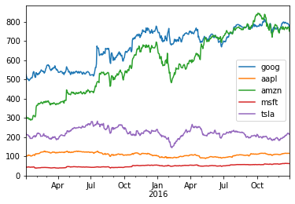
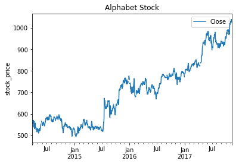
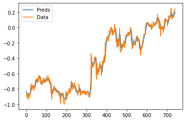
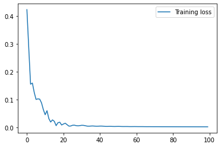
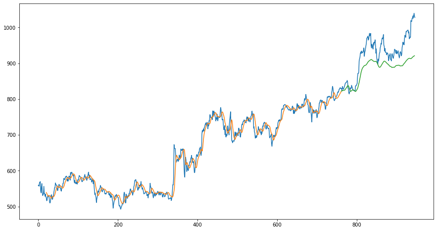

In this project, a simple LSTM neural network will predict future change in the stock prices of Alphabet (GOOG). Long Short-Term Memory (LSTM) networks are a type of recurrent neural network capable of learning order dependence in sequence prediction problems. The stock dataset was obtained from [Kaggle](https://www.kaggle.com/borismarjanovic/price-volume-data-for-all-us-stocks-etfs).


```python
# File: "goog-stock-prediction.py"
from google.colab import drive  # for Google Colab

drive.mount('/content/drive', force_remount=True)
```

    Mounted at /content/drive
    


```python
# File: "goog-stock-prediction.py"
import numpy as np

import random

import pandas as pd

import matplotlib.pyplot as plt

from pandas import datetime

import math, time

from sklearn import preprocessing

from sklearn.preprocessing import MinMaxScaler

import itertools

import datetime

from operator import itemgetter

from math import sqrt

import torch

import torch.nn as nn

import os


device = torch.device("cuda:0" if torch.cuda.is_available() else "cpu")

device
```


    device(type='cuda', index=0)


```python
# File: "goog-stock-prediction.py"
dir = "/content/drive/MyDrive/Colab Notebooks/Data"

def stocks_data(symbols, dates):

    df = pd.DataFrame(index=dates)

    for symbol in symbols:

        df_temp = pd.read_csv(dir + "/Stocks/{}.us.txt".format(symbol), index_col='Date',

                              parse_dates=True, usecols=['Date', 'Close'], na_values=['nan'])

        df_temp = df_temp.rename(columns={'Close': symbol})

        df = df.join(df_temp)

    return df


dates = pd.date_range('2015-01-02', '2016-12-31', freq='B')

symbols = ['goog', 'aapl', 'amzn', 'msft', 'tsla']

df = stocks_data(symbols, dates)

df.fillna(method='pad')

df.interpolate().plot()

plt.show()
```


    
{:.lead width="400" height="400" loading="lazy"}
    


```python
# File: "goog-stock-prediction.py"
df.head()
```


<div>
<style scoped>
    .dataframe tbody tr th:only-of-type {
        vertical-align: middle;
    }

    .dataframe tbody tr th {
        vertical-align: top;
    }

    .dataframe thead th {
        text-align: right;
    }
</style>
<table border="1" class="dataframe">
  <thead>
    <tr style="text-align: right;">
      <th></th>
      <th>goog</th>
      <th>aapl</th>
      <th>amzn</th>
      <th>msft</th>
      <th>tsla</th>
    </tr>
  </thead>
  <tbody>
    <tr>
      <th>2015-01-02</th>
      <td>524.81</td>
      <td>103.50</td>
      <td>308.52</td>
      <td>43.555</td>
      <td>219.31</td>
    </tr>
    <tr>
      <th>2015-01-05</th>
      <td>513.87</td>
      <td>100.58</td>
      <td>302.19</td>
      <td>43.154</td>
      <td>210.09</td>
    </tr>
    <tr>
      <th>2015-01-06</th>
      <td>501.96</td>
      <td>100.59</td>
      <td>295.29</td>
      <td>42.520</td>
      <td>211.28</td>
    </tr>
    <tr>
      <th>2015-01-07</th>
      <td>501.10</td>
      <td>102.01</td>
      <td>298.42</td>
      <td>43.062</td>
      <td>210.95</td>
    </tr>
    <tr>
      <th>2015-01-08</th>
      <td>502.68</td>
      <td>105.93</td>
      <td>300.46</td>
      <td>44.329</td>
      <td>210.62</td>
    </tr>
  </tbody>
</table>
</div>


```python
# File: "goog-stock-prediction.py"
dates = pd.date_range('2014-03-27', '2017-11-10', freq='B')

df_date = pd.DataFrame(index=dates)

df_goog = pd.read_csv(dir + "/Stocks/goog.us.txt", parse_dates=True, index_col=0)

df_goog = df_date.join(df_goog)

df_goog = df_goog[['Close']]


df_goog.plot()

plt.ylabel("stock_price")

plt.title("Alphabet Stock")

plt.show()
```


    
{:.lead width="400" height="400" loading="lazy"}
    


```python
# File: "goog-stock-prediction.py"
df_goog = df_goog.fillna(method='ffill')

scaler = MinMaxScaler(feature_range=(-1, 1))

nd_goog = scaler.fit_transform(df_goog)


def dataload(data_raw, seq_len):

    data = []


    for index in range(len(data_raw) - seq_len):

        data.append(data_raw[index: index + seq_len])


    data = np.array(data)

    test_size = int(np.round(0.2*data.shape[0]))

    train_size = data.shape[0] - test_size


    x_train = data[:train_size, :-1, :]

    y_train = data[:train_size, -1, :]

    x_test = data[train_size : train_size+test_size, :-1, :]

    y_test = data[train_size: train_size+test_size, -1, :]

    # inp1: which index(i) in raw data

    # inp2: which part of sequence(i to i + seq_len)

    # inp3: 'Close' ndarray


    return x_train, y_train, x_test, y_test


seq_len = 20

x_train, y_train, x_test, y_test = dataload(nd_goog, seq_len)

print('x_train.shape = ', x_train.shape)

print('y_train.shape = ', y_train.shape)

print('x_test.shape = ', x_test.shape)

print('y_test.shape = ', y_test.shape)


x_train = torch.from_numpy(x_train).type(torch.Tensor).to(device)

x_test = torch.from_numpy(x_test).type(torch.Tensor).to(device)

y_train = torch.from_numpy(y_train).type(torch.Tensor).to(device)

y_test = torch.from_numpy(y_test).type(torch.Tensor).to(device)


print(x_train.size(), y_train.size())
```

    x_train.shape =  (742, 19, 1)
    y_train.shape =  (742, 1)
    x_test.shape =  (185, 19, 1)
    y_test.shape =  (185, 1)
    torch.Size([742, 19, 1]) torch.Size([742, 1])
    


```python
# File: "goog-stock-prediction.py"
n_steps = seq_len - 1

batch_size = 742

epochs = 100


train = torch.utils.data.TensorDataset(x_train ,y_train)

test = torch.utils.data.TensorDataset(x_test,y_test)


train_loader = torch.utils.data.DataLoader(dataset=train, 

                                           batch_size=batch_size, 

                                           shuffle=False)


test_loader = torch.utils.data.DataLoader(dataset=test, 

                                          batch_size=batch_size, 

                                          shuffle=False)
```

## Train LSTM Network


```python
# File: "goog-stock-prediction.py"
input_dim = 1

hidden_dim = 32

num_layers = 2

output_dim = 1


class LSTM(nn.Module):

    def __init__(self, input_dim, hidden_dim, num_layers, output_dim):

        super(LSTM, self).__init__()

        self.hidden_dim = hidden_dim

        self.num_layers = num_layers


        self.lstm = nn.LSTM(input_dim, hidden_dim, num_layers, batch_first=True)


        self.fc = nn.Linear(hidden_dim, output_dim)


    def forward(self, x):

        h0 = torch.zeros(self.num_layers, x.size(0), self.hidden_dim).requires_grad_().to(device)

        c0 = torch.zeros(self.num_layers, x.size(0), self.hidden_dim).requires_grad_().to(device)


        out, (hn, cn) = self.lstm(x, (h0.detach(), c0.detach()))

        out = self.fc(out[:, -1, :])

        return out


model = LSTM(input_dim=input_dim, hidden_dim=hidden_dim, output_dim=output_dim, num_layers=num_layers).to(device)

loss_fn = torch.nn.MSELoss(size_average=True)

optimizer = torch.optim.Adam(model.parameters(), lr=0.01)


print(model)

print(len(list(model.parameters())))

for i in range(len(list(model.parameters()))):

    print(list(model.parameters())[i].size())
```

    LSTM(
      (lstm): LSTM(1, 32, num_layers=2, batch_first=True)
      (fc): Linear(in_features=32, out_features=1, bias=True)
    )
    10
    torch.Size([128, 1])
    torch.Size([128, 32])
    torch.Size([128])
    torch.Size([128])
    torch.Size([128, 32])
    torch.Size([128, 32])
    torch.Size([128])
    torch.Size([128])
    torch.Size([1, 32])
    torch.Size([1])
    

    /usr/local/lib/python3.6/dist-packages/torch/nn/_reduction.py:44: UserWarning: size_average and reduce args will be deprecated, please use reduction='mean' instead.
      warnings.warn(warning.format(ret))
    


```python
# File: "goog-stock-prediction.py"
hist = np.zeros(epochs)

seq_dim = seq_len - 1


for t in range(epochs):

    y_train_pred = model(x_train)

    loss = loss_fn(y_train_pred, y_train)

    if t % 10 == 0 and t != 0:

        print("Epoch ", t, "MSE: ", loss.item())

    hist[t] = loss.item()

    

    optimizer.zero_grad()

    loss.backward()

    optimizer.step()
```

    Epoch  10 MSE:  0.04599025472998619
    Epoch  20 MSE:  0.012709897942841053
    Epoch  30 MSE:  0.008051012642681599
    Epoch  40 MSE:  0.005265312269330025
    Epoch  50 MSE:  0.004085599910467863
    Epoch  60 MSE:  0.003436960279941559
    Epoch  70 MSE:  0.0031044648494571447
    Epoch  80 MSE:  0.0029210620559751987
    Epoch  90 MSE:  0.0027749529108405113
    

## Test Data


```python
# File: "goog-stock-prediction.py"
y_train = y_train.detach().cpu()

y_train_pred = y_train_pred.detach().cpu()


plt.plot(y_train_pred.numpy(), label="Preds")

plt.plot(y_train.numpy(), label="Data")

plt.legend()

plt.show()


plt.plot(hist, label="Training loss")

plt.legend()

plt.show()
```


    
{:.lead width="400" height="400" loading="lazy"}
    


    
{:.lead width="400" height="400" loading="lazy"}
    


```python
# File: "goog-stock-prediction.py"
np.shape(y_train_pred)
```


    torch.Size([742, 1])


```python
# File: "goog-stock-prediction.py"
# make predictions

y_test_pred = model(x_test)


y_test = y_test.detach().cpu()

y_test_pred = y_test_pred.detach().cpu()


# invert predictions

y_train_pred = scaler.inverse_transform(y_train_pred.detach().numpy())

y_train = scaler.inverse_transform(y_train.detach().numpy())

y_test_pred = scaler.inverse_transform(y_test_pred.detach().numpy())

y_test = scaler.inverse_transform(y_test.detach().numpy())
```


```python
# File: "goog-stock-prediction.py"
# shift train predictions for plotting

trainPredictPlot = np.empty_like(nd_goog)

trainPredictPlot[:, :] = np.nan

trainPredictPlot[seq_len:len(y_train_pred)+seq_len, :] = y_train_pred


# shift test predictions for plotting

testPredictPlot = np.empty_like(nd_goog)

testPredictPlot[:, :] = np.nan

testPredictPlot[len(y_train_pred)+seq_len-1:len(nd_goog)-1, :] = y_test_pred


# plot baseline and predictions

plt.figure(figsize=(15,8))

plt.plot(scaler.inverse_transform(nd_goog))

plt.plot(trainPredictPlot)

plt.plot(testPredictPlot)

plt.show()
```


    
{:.lead width="400" height="400" loading="lazy"}
    


Overall, the model reached a reasonable conclusion of Google's stock trend over a few years. However, the model may be overfitting due to the small size of data available.
