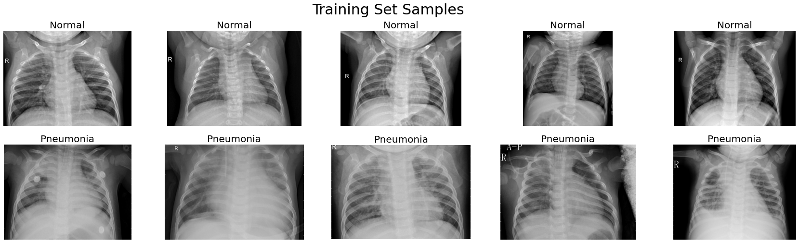
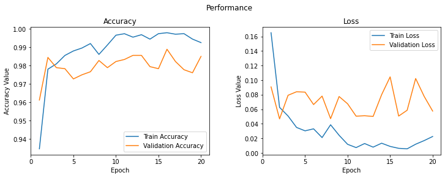
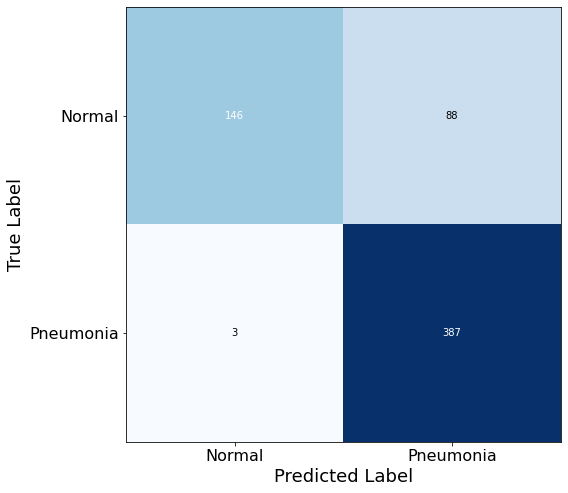
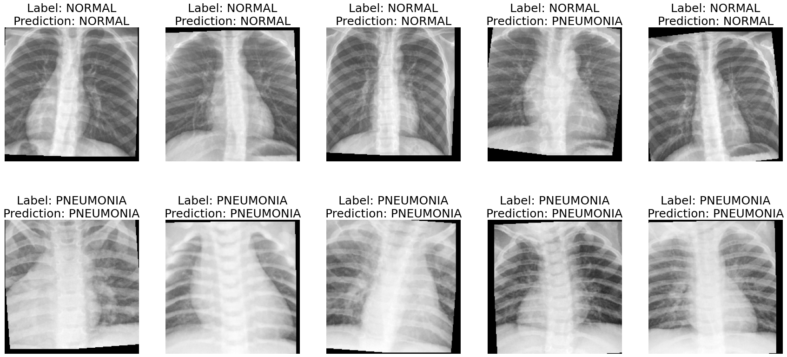

Pneumonia is an inflammatory condition of the lung primarily affecting the small air sacs known as alveoli. Symptoms typically include some combination of productive or dry cough, chest pain, fever and difficulty breathing. Although pneumonia is most likely to be caused by viral infections, bacterial infections, or fungi, COVID-19 is becoming a rising factor especially among the elderly. For some people, COVID-19 causes more severe symptoms like high fever, severe cough, and shortness of breath, which often indicates pneumonia. Nowadays, with this increasing importance of accurately detecting diseases, deep learning is often presented as a possible solution.


## Abstract

 {:.lead width="400" height="400" loading="lazy"}

The project aims to build a convolutional neural network (CNN) model that can detect the presence of pneumonia out of chest x-ray pictures. This was accomplished via the use of Residual Network (ResNet), a popular pre-trained neural network model for image classification. The dataset was obtained from Kaggle, consisting of around 6,000 images. In the end, the model accurately predicted most of the pneumonia images by achieving the F-score of 89, which suggests that the future of deep learning in medical engineering is bright.


## Technologies Used
- Google Colab Jupyter Notebook with GPU Acceleration
  - [PyTorch](https://pytorch.org/)


## Computation

[Click here to view the raw notebook.](https://github.com/chan030609/resnet-pneumonia-detection/blob/master/resnet_pneumonia_detection.ipynb)

### Importing Libraries


~~~py
# File: "pneumonia-detection.py"
%matplotlib inline

import numpy as np

import pandas as pd

import matplotlib.pyplot as plt

from matplotlib.image import imread

import seaborn as sns

import random

import cv2

import copy


import torch

import torch.nn as nn

import torch.nn.functional as F

import torchvision

import torchvision.transforms as tt

import torchvision.models as models

from torchvision.datasets import ImageFolder

from torchvision.utils import make_grid

from torch.utils.data import random_split, DataLoader


from mlxtend.plotting import plot_confusion_matrix

from sklearn.metrics import confusion_matrix


import os
~~~

### Data Augmentation


```python
# File: "pneumonia-detection.py"
data_dir = '/content/drive/My Drive/Colab Notebooks/chest-array/'

print(os.listdir(data_dir))

classes = os.listdir(data_dir + "train")

print(classes)
```

    ['test', 'train']
    ['NORMAL', 'PNEUMONIA']
    


```python
# File: "pneumonia-detection.py"
pneumonia_files = os.listdir(data_dir + "train/PNEUMONIA")

print('No. of training examples for Pneumonia:', len(pneumonia_files))

normal_files = os.listdir(data_dir + "train/NORMAL")

print('No. of training examples for Normal:', len(normal_files))
```

    No. of training examples for Pneumonia: 3875
    No. of training examples for Normal: 1341
    

```python
# File: "pneumonia-detection.py"
dataset = ImageFolder(data_dir+'train', transform=tt.Compose([tt.Resize(255),

                                                              tt.CenterCrop(224),

                                                              tt.RandomHorizontalFlip(),

                                                              tt.RandomRotation(10),

                                                              tt.RandomGrayscale(),

                                                              tt.RandomAffine(translate=(0.05, 0.05), degrees=0),

                                                              tt.ToTensor(),

                                                              tt.Normalize(mean=[0.485, 0.456, 0.406],

                                                                           std=[0.229, 0.224, 0.225],

                                                                           inplace=True)

                                                              ]))

dataset
```
    Dataset ImageFolder
        Number of datapoints: 5216
        Root location: /content/drive/My Drive/Colab Notebooks/chest-array/train
        StandardTransform
    Transform: Compose(
                   Resize(size=255, interpolation=PIL.Image.BILINEAR)
                   CenterCrop(size=(224, 224))
                   RandomHorizontalFlip(p=0.5)
                   RandomRotation(degrees=[-10.0, 10.0], resample=False, expand=False)
                   RandomGrayscale(p=0.1)
                   RandomAffine(degrees=[0.0, 0.0], translate=(0.05, 0.05))
                   ToTensor()
                   Normalize(mean=[0.485, 0.456, 0.406], std=[0.229, 0.224, 0.225])
               )
```


```python
# File: "pneumonia-detection.py"
img, label = dataset[0]

print(img.shape, label)
```

    torch.Size([3, 224, 224]) 0
    

After transformation, images are expressed as 224 pixels by 224 pixels with RGB colors.


```python
# File: "pneumonia-detection.py"
def plot_samples(samples):

    fig, ax = plt.subplots(nrows=2, ncols =5, figsize=(30,8))

    for i in range(len(samples)):

        image = cv2.cvtColor(imread(samples[i]), cv2.COLOR_BGR2RGB)

        ax[i//5][i%5].imshow(image)

        if i<5:

            ax[i//5][i%5].set_title("Normal", fontsize=20)

        else:

            ax[i//5][i%5].set_title("Pneumonia", fontsize=20)

        ax[i//5][i%5].axis('off')
```


```python
# File: "pneumonia-detection.py"
rand_samples = random.sample([os.path.join(data_dir+'/train/NORMAL', filename) 

                              for filename in os.listdir(data_dir+'/train/NORMAL')], 5) + \

    random.sample([os.path.join(data_dir+'/train/PNEUMONIA', filename) 

                   for filename in os.listdir(data_dir+'/train/PNEUMONIA')], 5)

plot_samples(rand_samples)

plt.suptitle('Training Set Samples', fontsize=30)

plt.show()
```


 {:.lead width="400" height="400" loading="lazy"}
    


The difference between normal x-rays and pneumonia x-rays does not seem apparent.
### Train, Validation, Test Data


```python
# File: "pneumonia-detection.py"
# delete this portion for a different result

random_seed = 2021

torch.manual_seed(random_seed);
```

For greater accuracy, a validation set, 30% of the original training data, was separated from the training set.


```python
# File: "pneumonia-detection.py"
train_size = round(len(dataset)*0.7)

val_size = len(dataset) - train_size

train_ds, val_ds = random_split(dataset, [train_size, val_size])

len(train_ds), len(val_ds)
```


    (3651, 1565)


```python
# File: "pneumonia-detection.py"
batch_size = 128

train_dl = DataLoader(train_ds, batch_size, shuffle=True, num_workers=4, pin_memory=True)

val_dl = DataLoader(val_ds, batch_size*2, num_workers=4, pin_memory=True)


```

### GPU


```python
# File: "pneumonia-detection.py"
device = torch.device("cuda:0" if torch.cuda.is_available() else "cpu")

device
```


    device(type='cuda', index=0)


### Loss and Accuracy Calculation


```python
# File: "pneumonia-detection.py"
def accuracy(outputs, labels):

    _, preds = torch.max(outputs, dim=1) 

    return torch.tensor(torch.sum(preds == labels).item() / len(preds)), preds
```


```python
# File: "pneumonia-detection.py"
class PneumoniaModelBase(nn.Module):


    # train loss and accuracy every batch

    def training_step(self, batch, weight):

        images, labels = batch

        images = images.to(device)

        labels = labels.to(device)

        out = self(images)  # generate predictions

        loss = F.cross_entropy(out, labels, weight=weight)  # weighted loss

        acc, preds = accuracy(out, labels)  # accuracy

        

        return {'train_loss': loss, 'train_acc': acc}


    # train loss and accuracy every epoch

    def train_epoch_end(self, outputs):

        batch_losses = [x['train_loss'] for x in outputs]

        epoch_loss = torch.stack(batch_losses).mean()

        batch_accs = [x['train_acc'] for x in outputs]

        epoch_acc = torch.stack(batch_accs).mean()


        return {'train_loss': epoch_loss.item(), 'train_acc': epoch_acc.item()}


    # validation loss, accuracy, prediction, and label every batch

    def validation_step(self, batch):

        images, labels = batch

        images = images.to(device)

        labels = labels.to(device)

        out = self(images)

        loss = F.cross_entropy(out, labels)

        acc, preds = accuracy(out, labels)

        

        return {'val_loss': loss.detach(), 'val_acc': acc.detach(), 'preds': preds.detach(), 'labels': labels.detach()}


    # validation loss and accuracy every epoch

    def validation_epoch_end(self, outputs):

        batch_losses = [x['val_loss'] for x in outputs]

        epoch_loss = torch.stack(batch_losses).mean()

        batch_accs = [x['val_acc'] for x in outputs]

        epoch_acc = torch.stack(batch_accs).mean()


        return {'val_loss': epoch_loss.item(), 'val_acc': epoch_acc.item()}

    


    # training result every peoch

    def epoch_end(self, epoch, train_result, val_result):

        print('Epoch [{}], train_loss: {:.4f}, train_acc: {:.4f}, val_loss: {:.4f}, val_acc: {:.4f}' \

              .format(epoch+1, train_result['train_loss'], train_result['train_acc'], val_result['val_loss'], val_result['val_acc']))

        


    # test loss, accuracy, prediction list, and label list every epoch

    def test_prediction(self, outputs):

        batch_losses = [x['val_loss'] for x in outputs]

        epoch_loss = torch.stack(batch_losses).mean()

        batch_accs = [x['val_acc'] for x in outputs]

        epoch_acc = torch.stack(batch_accs).mean()

        batch_preds = [pred for x in outputs for pred in x['preds'].tolist()]

        batch_labels = [lab for x in outputs for lab in x['labels'].tolist()]


        return {'test_loss': epoch_loss.item(), 'test_acc': epoch_acc.item(), 'test_preds': batch_preds, 'test_labels': batch_labels}
```

### ResNet50 Architecture


```python
# File: "pneumonia-detection.py"
class PneumoniaResnet(PneumoniaModelBase):

    


    def __init__(self):

        super().__init__()

        self.network = models.resnet50(pretrained=True)

        for param in self.network.fc.parameters():

            param.require_grad = False

        num_features = self.network.fc.in_features

        self.network.fc = nn.Linear(num_features, 2)

    


    def forward(self, xb):

        return self.network(xb)
```

### Helper Functions


```python
# File: "pneumonia-detection.py"
@torch.no_grad()


# evaluation result

def evaluate(model, val_loader):

    model.eval()

    outputs = [model.validation_step(batch) for batch in val_loader]

    

    return model.validation_epoch_end(outputs)


# model execution

def fit(epochs, lr, model, train_loader, val_loader, weight, weight_decay=0, grad_clip=None, opt_func=torch.optim.SGD):

    torch.cuda.empty_cache

    history = {}

    optimizer = opt_func(model.parameters(), lr)

    best_loss = 1


    for epoch in range(epochs):

        model.train()

        train_outputs = []

        lrs = []


        for batch in train_loader:

            outputs = model.training_step(batch, weight)

            loss = outputs['train_loss']

            train_outputs.append(outputs)

            train_results = model.train_epoch_end(train_outputs)

            

            loss.backward()


            if grad_clip:

                nn.utils.clip_grad_value_(model.parameters(), grad_clip)

            

            optimizer.step()

            optimizer.zero_grad()


        val_results = evaluate(model, val_loader)

        if val_results['val_loss'] < best_loss and epoch + 1 > 15:

            best_loss = min(best_loss, val_results['val_loss'])

            best_model_wts = copy.deepcopy(model.state_dict())


        model.epoch_end(epoch, train_results, val_results)

        to_add = {'train_loss': train_results['train_loss'],

                  'train_acc': train_results['train_acc'],

                  'val_loss': val_results['val_loss'],

                  'val_acc': val_results['val_acc'],

                  'lrs': lrs}


        for key, val in to_add.items():

            if key in history:

                history[key].append(val)

            else:

                history[key] = [val] 

    

    model.load_state_dict(best_model_wts)


    return history, optimizer, best_loss
```

### Train and Evaluate Model


```python
# File: "pneumonia-detection.py"
model = PneumoniaResnet().to(device)
```


```python
# File: "pneumonia-detection.py"
epochs = 20

lr = 0.0001

grad_clip = None

weight_decay = 1e-4

opt_func = torch.optim.Adam


# weighted loss for class imbalance

weight = torch.FloatTensor([3875/(3875+1341), 1341/(3875+1341)]).to(device)
```


```python
# File: "pneumonia-detection.py"
history, optimizer, best_loss = fit(epochs, lr, model, train_dl, val_dl, weight, grad_clip=grad_clip, opt_func=opt_func)
```

    Epoch [1], train_loss: 0.1651, train_acc: 0.9345, val_loss: 0.0907, val_acc: 0.9611
    Epoch [2], train_loss: 0.0627, train_acc: 0.9780, val_loss: 0.0468, val_acc: 0.9844
    Epoch [3], train_loss: 0.0508, train_acc: 0.9809, val_loss: 0.0792, val_acc: 0.9788
    Epoch [4], train_loss: 0.0351, train_acc: 0.9855, val_loss: 0.0841, val_acc: 0.9782
    Epoch [5], train_loss: 0.0304, train_acc: 0.9879, val_loss: 0.0835, val_acc: 0.9727
    Epoch [6], train_loss: 0.0332, train_acc: 0.9895, val_loss: 0.0665, val_acc: 0.9749
    Epoch [7], train_loss: 0.0212, train_acc: 0.9919, val_loss: 0.0781, val_acc: 0.9766
    Epoch [8], train_loss: 0.0388, train_acc: 0.9860, val_loss: 0.0471, val_acc: 0.9827
    Epoch [9], train_loss: 0.0243, train_acc: 0.9912, val_loss: 0.0775, val_acc: 0.9788
    Epoch [10], train_loss: 0.0119, train_acc: 0.9965, val_loss: 0.0675, val_acc: 0.9821
    Epoch [11], train_loss: 0.0075, train_acc: 0.9973, val_loss: 0.0506, val_acc: 0.9833
    Epoch [12], train_loss: 0.0130, train_acc: 0.9954, val_loss: 0.0511, val_acc: 0.9855
    Epoch [13], train_loss: 0.0081, train_acc: 0.9968, val_loss: 0.0502, val_acc: 0.9855
    Epoch [14], train_loss: 0.0135, train_acc: 0.9943, val_loss: 0.0801, val_acc: 0.9794
    Epoch [15], train_loss: 0.0091, train_acc: 0.9973, val_loss: 0.1045, val_acc: 0.9782
    Epoch [16], train_loss: 0.0064, train_acc: 0.9978, val_loss: 0.0507, val_acc: 0.9888
    Epoch [17], train_loss: 0.0057, train_acc: 0.9970, val_loss: 0.0587, val_acc: 0.9821
    Epoch [18], train_loss: 0.0121, train_acc: 0.9973, val_loss: 0.1022, val_acc: 0.9777
    Epoch [19], train_loss: 0.0170, train_acc: 0.9944, val_loss: 0.0777, val_acc: 0.9760
    Epoch [20], train_loss: 0.0227, train_acc: 0.9925, val_loss: 0.0575, val_acc: 0.9849
    

```python
# File: "pneumonia-detection.py"
print('Best loss is: ', best_loss)
```

    Best loss is:  0.050678715109825134
    


```python
# File: "pneumonia-detection.py"
bestmodel = {'model': PneumoniaResnet(),

             'state_dict': model.state_dict(),

             'optimizer': optimizer.state_dict()}


# saves model for later use

torch.save(bestmodel, 'PneumoniaRestnet.pth')
```


```python
# File: "pneumonia-detection.py"


def load_checkpoint(filepath):

    checkpoint = torch.load(filepath)

    model = checkpoint['model']

    model.load_state_dict(checkpoint['state_dict'])

    

    for parameter in model.parameters():

        parameter.requires_grad = False


    model.eval()

    return model
```

### Plot Accuracy and Loss


```python
# File: "pneumonia-detection.py"
fig, (ax1, ax2) = plt.subplots(1, 2, figsize=(12,4))

title = fig.suptitle('Performance', fontsize=12)

fig.subplots_adjust(top=0.85, wspace=0.3)


epoch_list = list(range(1, epochs+1))


ax1.plot(epoch_list, history['train_acc'], label='Train Accuracy')

ax1.plot(epoch_list, history['val_acc'], label='Validation Accuracy')

ax1.set_xticks(np.arange(0, epochs+1, 5))

ax1.set_ylabel('Accuracy Value')

ax1.set_xlabel('Epoch')

ax1.set_title('Accuracy')

legend1 = ax1.legend(loc="best")


ax2.plot(epoch_list, history['train_loss'], label='Train Loss')

ax2.plot(epoch_list, history['val_loss'], label='Validation Loss')

ax2.set_xticks(np.arange(0, epochs+1, 5))

ax2.set_ylabel('Loss Value')

ax2.set_xlabel('Epoch')

ax2.set_title('Loss')

legend2 = ax2.legend(loc="best")
```

 {:.lead width="400" height="400" loading="lazy"}
    


### Test Set Prediction


```python
# File: "pneumonia-detection.py"
@torch.no_grad()


def test_predict(model, test_loader):

    model.eval()

    outputs = [model.validation_step(batch) for batch in test_loader]

    results = model.test_prediction(outputs)

    

    print('test_loss: {:.4f}, test_acc: {:.4f}'.format(results['test_loss'], results['test_acc']))


    return results['test_preds'], results['test_labels']


test_dataset = ImageFolder(data_dir+'test', transform=tt.Compose([tt.Resize(255),

                                                              tt.CenterCrop(224),

                                                              tt.RandomHorizontalFlip(),

                                                              tt.RandomRotation(10),

                                                              tt.RandomGrayscale(),

                                                              tt.RandomAffine(translate=(0.05, 0.05), degrees=0),

                                                              tt.ToTensor(),

                                                              tt.Normalize(mean=[0.485, 0.456, 0.406],

                                                                           std=[0.229, 0.224, 0.225],

                                                                           inplace=True)

                                                              ]))
```


```python
# File: "pneumonia-detection.py"
test_dl = DataLoader(test_dataset)

preds, labels = test_predict(model, test_dl)
```

    test_loss: 0.7151, test_acc: 0.8542
    

### Model Evaluation Metrics

Since there is a huge data class imbalance, it is better to look at the F1 score than the accuracy.


```python
# File: "pneumonia-detection.py"
cm = confusion_matrix(labels, preds)

plt.figure()

plot_confusion_matrix(cm, figsize=(12,8), cmap=plt.cm.Blues)

plt.xticks(range(2), ['Normal', 'Pneumonia'], fontsize=16)

plt.yticks(range(2), ['Normal', 'Pneumonia'], fontsize=16)

plt.xlabel('Predicted Label',fontsize=18)

plt.ylabel('True Label',fontsize=18)

plt.show()
```


    <Figure size 432x288 with 0 Axes>
    
 {:.lead width="400" height="400" loading="lazy"}    
    

```python
# File: "pneumonia-detection.py"
tn, fp, fn, tp = cm.ravel()


accuracy = (np.array(preds) == np.array(labels)).sum() / len(preds)

precision = tp/(tp+fp)

recall = tp/(tp+fn)

f1 = 2*((precision*recall)/(precision+recall))


print("Accuracy of the model is {:.2f}".format(accuracy))

print("Recall of the model is {:.2f}".format(recall))

print("Precision of the model is {:.2f}".format(precision))

print("F1 Score of the model is {:.2f}".format(f1))
```

    Accuracy of the model is 0.85
    Recall of the model is 0.99
    Precision of the model is 0.81
    F1 Score of the model is 0.89
    
### Testing the Model
 {:.lead width="400" height="400" loading="lazy"}


### Conclusion

In conclusion, the model accurately predicted most of the pneumonia images. However, some false positives are fatal since they might increase the cost of healthcare and lead to panic. Better performance could have been achieved by tuning the hyperparameters. Once the best model is found, the practical use of machine learning in pneumonia detection can be considered.
