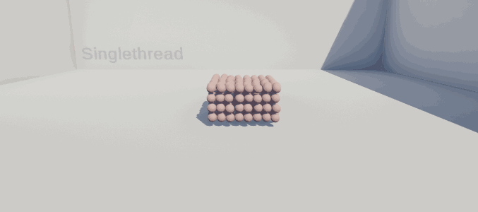
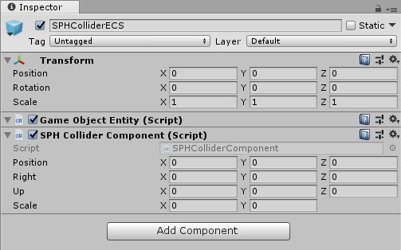
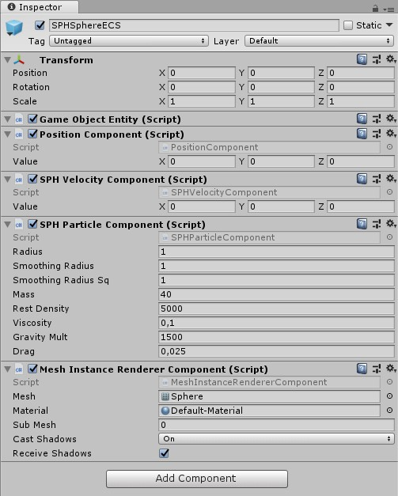
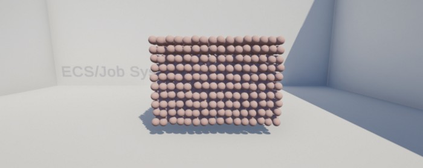

DOTS marks a fundamental change in direction of Unity’s architecture. DOTS is a combination of technologies that are new to Unity, which requires a new way of working with Unity and a different approach to thinking about code and data using data-oriented design (DoD), as opposed to the object-oriented approach of Unity without DOTS. In this project, DOTS and its new features including Entity Component System (ECS), the Job System, and the Burst compiler are being compared to its traditional counterpart, Soft Particle Hydrodynamic (SPH).

## SPH

Soft Particle Hydrodynamic (SPH) is a traditional computational method used for simulating the mechanics of continuum media, such as solid mechanics and fluid flows. The reason why it had been increasingly used for fluid dynamics is due to several benefits over traditional grid-based techniques. First, SPH guarantees conservation of mass without extra computation since the particles themselves represent mass. Second, SPH computes pressure from weighted contributions of neighboring particles rather than by solving linear systems of equations. Finally, unlike grid-based techniques, which must track fluid boundaries, SPH creates a free surface for two-phase interacting fluids directly since the particles represent the denser fluid (usually water) and empty space represents the lighter fluid (usually air). _(Source: [Wikipedia](https://en.wikipedia.org/wiki/Smoothed-particle_hydrodynamics))_

```cs
// File: 'fluid.cs'
void Start()
{
    InitSPH();
}

void Update()
{
    ComputeDensityPressure();
    ComputeForces();
    Integrate();
    ComputeColliders();
    ApplyPosition();
}
```
 

## ECS, Job System, Burst Compiler

Unity’s new high-performance, multithreaded Data-Oriented Technology Stack (DOTS) allows for using multicore processors. The Jobs System in Unity allows for the execution of code across multiple cores at once, significantly speeding up heavy tasks such as pathfinding and similarly repetitive logic. Additionally, when something is set to run as a job, Unity supports use of the Burst Compiler, which will compile that bit of code into high-performance assembly code. _(Source: [Unity](https://unity.com/dots))_

### Initialization

```cs
// File: "fluid.cs'

void Start()
{
    // Import
    manager = World.Active.GetOrCreateManager<EntityManager>();

    // Setup
    AddColliders();
    AddParticles(amount);
}
```

In the single-threaded version, I could just get the GameObjects defined as Collider and run the collision solving algorithm. Here, I first need to turn them into entities to be processed by our systems. I put them into a NativeArray (don’t forget to call Dispose() after using it or it’ll create some errors). I then instantiate the entities using a GameObject prefab that serves as a model for all the components to use for each entity.
I loop through all the entities to set their values, based on the GameObjects defined as colliders.

```cs
// File: "fluid.cs"

void AddColliders()
{
    // Find all colliders
    GameObject[] colliders = GameObject.FindGameObjectsWithTag("SPHCollider");

    // Turn them into entities
    NativeArray<Entity> entities = new NativeArray<Entity>(colliders.Length, Allocator.Temp);
    manager.Instantiate(sphColliderPrefab, entities);

    // Set data
    for (int i = 0; i < colliders.Length; i++)
    {
        manager.SetComponentData(entities[i], new SPHCollider
        {
            position = colliders[i].transform.position,
            right = colliders[i].transform.right,
            up = colliders[i].transform.up,
            scale = new float2(colliders[i].transform.localScale.x / 2f, colliders[i].transform.localScale.y / 2f)
        });
    }

    // Done
    entities.Dispose();
}
```

The sphColliderPrefab is composed of two components: a GameObjectEntity and an SPHCollider.

 

My custom component holds the data I need to perform the wall collision later (it’s the same as the single-threaded one, I’m just using the new mathematic library with float3 instead of Vector3). The ComponentDataWrapper part allows the component to be added to the GameObject in the inspector.

```cs
// File: "fluid.cs"

using Unity.Entities;
using Unity.Mathematics;

[System.Serializable]
public struct SPHCollider : IComponentData
{
    public float3 position;
    public float3 right;
    public float3 up;
    public float2 scale;
}

public class SPHColliderComponent : ComponentDataWrapper<SPHCollider> { }


void AddParticles(int _amount)
{
    NativeArray<Entity> entities = new NativeArray<Entity>(_amount, Allocator.Temp);
    manager.Instantiate(sphParticlePrefab, entities);

    for (int i = 0; i < _amount; i++)
    {
        manager.SetComponentData(entities[i], new Position { Value = new float3(i % 16 + UnityEngine.Random.Range(-0.1f, 0.1f), 2 + (i / 16 / 16) * 1.1f, (i / 16) % 16) + UnityEngine.Random.Range(-0.1f, 0.1f) });
    }

    entities.Dispose();
}
```

Now, it's time to work on the sphParticlePrefab.

 

There’s a PositionComponent so that I can see the position of the entity for rendering; a SPHVelocityComponent just to store the velocity of the particle; a SPHParticleComponent to store the properties of the entity; and a MeshInstanceRendererComponent, which is the same as a MeshFilter and a MeshRenderer, allowing this to be rendered by Unity.

```cs
// File: "fluid.cs"
using Unity.Entities;
using Unity.Mathematics;

[System.Serializable]
public struct SPHVelocity : IComponentData
{
    public float3 Value;
}

public class SPHVelocityComponent : ComponentDataWrapper<SPHVelocity> { }

using Unity.Entities;

[System.Serializable]
public struct SPHParticle : ISharedComponentData
{
    public float radius;
    public float smoothingRadius;
    public float smoothingRadiusSq;

    public float mass;

    public float restDensity;
    public float viscosity;
    public float gravityMult;

    public float drag;
}

public class SPHParticleComponent : SharedComponentDataWrapper<SPHParticle> { }
```
 

### System and Jobs

Finished with the initialization, we shall move on to the system and jobs.

```cs
// File: "fluid.cs"
ComponentGroup SPHCharacterGroup;
ComponentGroup SPHColliderGroup;

protected override void OnCreateManager()
{
    SPHCharacterGroup = GetComponentGroup(ComponentType.ReadOnly(typeof(SPHParticle)), typeof(Position), typeof(SPHVelocity));
    SPHColliderGroup = GetComponentGroup(ComponentType.ReadOnly(typeof(SPHCollider)));
}

protected override JobHandle OnUpdate(JobHandle inputDeps)
{
    return inputDeps;
}

EntityManager.GetAllUniqueSharedComponentData(uniqueTypes);

ComponentDataArray<SPHCollider> colliders = SPHColliderGroup.GetComponentDataArray<SPHCollider>();
int colliderCount = colliders.Length;

for (int typeIndex = 1; typeIndex < uniqueTypes.Count; typeIndex++)
{

}


// Get the current chunk setting
SPHParticle settings = uniqueTypes[typeIndex];
SPHCharacterGroup.SetFilter(settings);

// Cache the data
ComponentDataArray<Position> positions = SPHCharacterGroup.GetComponentDataArray<Position>();
ComponentDataArray<SPHVelocity> velocities = SPHCharacterGroup.GetComponentDataArray<SPHVelocity>();

int cacheIndex = typeIndex - 1;
int particleCount = positions.Length;

NativeMultiHashMap<int, int> hashMap = new NativeMultiHashMap<int, int>(particleCount, Allocator.TempJob);

NativeArray<Position> particlesPosition = new NativeArray<Position>(particleCount, Allocator.TempJob, NativeArrayOptions.UninitializedMemory);
NativeArray<SPHVelocity> particlesVelocity = new NativeArray<SPHVelocity>(particleCount, Allocator.TempJob, NativeArrayOptions.UninitializedMemory);
NativeArray<float3> particlesForces = new NativeArray<float3>(particleCount, Allocator.TempJob, NativeArrayOptions.UninitializedMemory);
NativeArray<float> particlesPressure = new NativeArray<float>(particleCount, Allocator.TempJob, NativeArrayOptions.UninitializedMemory);
NativeArray<float> particlesDensity = new NativeArray<float>(particleCount, Allocator.TempJob, NativeArrayOptions.UninitializedMemory);
NativeArray<int> particleIndices = new NativeArray<int>(particleCount, Allocator.TempJob, NativeArrayOptions.UninitializedMemory);

NativeArray<int> cellOffsetTableNative = new NativeArray<int>(cellOffsetTable, Allocator.TempJob);
NativeArray<SPHCollider> copyColliders = new NativeArray<SPHCollider>(colliderCount, Allocator.TempJob, NativeArrayOptions.UninitializedMemory);

// Add new or dispose previous particle chunks
PreviousParticle nextParticles = new PreviousParticle
{
    hashMap = hashMap,
    particlesPosition = particlesPosition,
    particlesVelocity = particlesVelocity,
    particlesForces = particlesForces,
    particlesPressure = particlesPressure,
    particlesDensity = particlesDensity,
    particleIndices = particleIndices,
    cellOffsetTable = cellOffsetTableNative,
    copyColliders = copyColliders
};

if (cacheIndex > previousParticles.Count - 1)
{
    previousParticles.Add(nextParticles);
}
else
{
    previousParticles[cacheIndex].hashMap.Dispose();
    previousParticles[cacheIndex].particlesPosition.Dispose();
    previousParticles[cacheIndex].particlesVelocity.Dispose();
    previousParticles[cacheIndex].particlesForces.Dispose();
    previousParticles[cacheIndex].particlesPressure.Dispose();
    previousParticles[cacheIndex].particlesDensity.Dispose();
    previousParticles[cacheIndex].particleIndices.Dispose();
    previousParticles[cacheIndex].cellOffsetTable.Dispose();
    previousParticles[cacheIndex].copyColliders.Dispose();
}
previousParticles[cacheIndex] = nextParticles;


// Copy the component data to native arrays
CopyComponentData<Position> particlesPositionJob = new CopyComponentData<Position> { Source = positions, Results = particlesPosition };
JobHandle particlesPositionJobHandle = particlesPositionJob.Schedule(particleCount, 64, inputDeps);

CopyComponentData<SPHVelocity> particlesVelocityJob = new CopyComponentData<SPHVelocity> { Source = velocities, Results = particlesVelocity };
JobHandle particlesVelocityJobHandle = particlesVelocityJob.Schedule(particleCount, 64, inputDeps);

CopyComponentData<SPHCollider> copyCollidersJob = new CopyComponentData<SPHCollider> { Source = colliders, Results = copyColliders };
JobHandle copyCollidersJobHandle = copyCollidersJob.Schedule(colliderCount, 64, inputDeps);

MemsetNativeArray<float> particlesPressureJob = new MemsetNativeArray<float> { Source = particlesPressure, Value = 0.0f };
JobHandle particlesPressureJobHandle = particlesPressureJob.Schedule(particleCount, 64, inputDeps);

MemsetNativeArray<float> particlesDensityJob = new MemsetNativeArray<float> { Source = particlesDensity, Value = 0.0f };
JobHandle particlesDensityJobHandle = particlesDensityJob.Schedule(particleCount, 64, inputDeps);

MemsetNativeArray<int> particleIndicesJob = new MemsetNativeArray<int> { Source = particleIndices, Value = 0 };
JobHandle particleIndicesJobHandle = particleIndicesJob.Schedule(particleCount, 64, inputDeps);

MemsetNativeArray<float3> particlesForcesJob = new MemsetNativeArray<float3> { Source = particlesForces, Value = new float3(0, 0, 0) };
JobHandle particlesForcesJobHandle = particlesForcesJob.Schedule(particleCount, 64, inputDeps);


// Put positions into a hashMap
HashPositions hashPositionsJob = new HashPositions
{
    positions = particlesPosition,
    hashMap = hashMap.ToConcurrent(),
    cellRadius = settings.radius
};
JobHandle hashPositionsJobHandle = hashPositionsJob.Schedule(particleCount, 64, particlesPositionJobHandle);

JobHandle mergedPositionIndicesJobHandle = JobHandle.CombineDependencies(hashPositionsJobHandle, particleIndicesJobHandle);

MergeParticles mergeParticlesJob = new MergeParticles
{
    particleIndices = particleIndices
};
JobHandle mergeParticlesJobHandle = mergeParticlesJob.Schedule(hashMap, 64, mergedPositionIndicesJobHandle);

JobHandle mergedMergedParticlesDensityPressure = JobHandle.CombineDependencies(mergeParticlesJobHandle, particlesPressureJobHandle, particlesDensityJobHandle);


// Compute density pressure
ComputeDensityPressure computeDensityPressureJob = new ComputeDensityPressure
{
    particlesPosition = particlesPosition,
    densities = particlesDensity,
    pressures = particlesPressure,
    hashMap = hashMap,
    cellOffsetTable = cellOffsetTableNative,
    settings = settings
};
JobHandle computeDensityPressureJobHandle = computeDensityPressureJob.Schedule(particleCount, 64, mergedMergedParticlesDensityPressure);

// Merge
JobHandle mergeComputeDensityPressureVelocityForces = JobHandle.CombineDependencies(computeDensityPressureJobHandle, particlesForcesJobHandle, particlesVelocityJobHandle);

// Compute forces
ComputeForces computeForcesJob = new ComputeForces
{
    particlesPosition = particlesPosition,
    particlesVelocity = particlesVelocity,
    particlesForces = particlesForces,
    particlesPressure = particlesPressure,
    particlesDensity = particlesDensity,
    cellOffsetTable = cellOffsetTableNative,
    hashMap = hashMap,
    settings = settings
};
JobHandle computeForcesJobHandle = computeForcesJob.Schedule(particleCount, 64, mergeComputeDensityPressureVelocityForces);

// Integrate
Integrate integrateJob = new Integrate
{
    particlesPosition = particlesPosition,
    particlesVelocity = particlesVelocity,
    particlesDensity = particlesDensity,
    particlesForces = particlesForces
};
JobHandle integrateJobHandle = integrateJob.Schedule(particleCount, 64, computeForcesJobHandle);


JobHandle mergedIntegrateCollider = JobHandle.CombineDependencies(integrateJobHandle, copyCollidersJobHandle);

// Compute Colliders
ComputeColliders computeCollidersJob = new ComputeColliders
{
    particlesPosition = particlesPosition,
    particlesVelocity = particlesVelocity,
    copyColliders = copyColliders,
    settings = settings
};
JobHandle computeCollidersJobHandle = computeCollidersJob.Schedule(particleCount, 64, mergedIntegrateCollider);

// Apply positions
ApplyPositions applyPositionsJob = new ApplyPositions
{
    particlesPosition = particlesPosition,
    particlesVelocity = particlesVelocity,
    positions = positions,
    velocities = velocities
};
JobHandle applyPositionsJobHandle = applyPositionsJob.Schedule(particleCount, 64, computeCollidersJobHandle);

inputDeps = applyPositionsJobHandle;

[BurstCompile]
private struct ComputeDensityPressure : IJobParallelFor
{
    [ReadOnly] public NativeMultiHashMap<int, int> hashMap;
    [ReadOnly] public NativeArray<int> cellOffsetTable;
    [ReadOnly] public NativeArray<Position> particlesPosition;
    [ReadOnly] public SPHParticle settings;

    public NativeArray<float> densities;
    public NativeArray<float> pressures;

    const float PI = 3.14159274F;
    const float GAS_CONST = 2000.0f;

    public void Execute(int index)
    {
        // Cache
        int particleCount = particlesPosition.Length;
        float3 position = particlesPosition[index].Value;
        float density = 0.0f;
        int i, hash, j;
        int3 gridOffset;
        int3 gridPosition = GridHash.Quantize(position, settings.radius);
        bool found;

        // Find neighbors
        for (int oi = 0; oi < 27; oi++)
        {
            i = oi * 3;
            gridOffset = new int3(cellOffsetTable[i], cellOffsetTable[i + 1], cellOffsetTable[i + 2]);
            hash = GridHash.Hash(gridPosition + gridOffset);
            NativeMultiHashMapIterator<int> iterator;
            found = hashMap.TryGetFirstValue(hash, out j, out iterator);
            while (found)
            {
                // Neighbor found, get density
                float3 rij = particlesPosition[j].Value - position;
                float r2 = math.lengthsq(rij);

                if (r2 < settings.smoothingRadiusSq)
                {
                    density += settings.mass * (315.0f / (64.0f * PI * math.pow(settings.smoothingRadius, 9.0f))) * math.pow(settings.smoothingRadiusSq - r2, 3.0f);
                }

                // Next neighbor
                found = hashMap.TryGetNextValue(out j, ref iterator);
            }
        }

        // Apply density and compute/apply pressure
        densities[index] = density;
        pressures[index] = GAS_CONST * (density - settings.restDensity);
    }
}


protected override void OnStopRunning()
{
    for (int i = 0; i < previousParticles.Count; i++)
    {
        previousParticles[i].hashMap.Dispose();
        previousParticles[i].particlesPosition.Dispose();
        previousParticles[i].particlesVelocity.Dispose();
        previousParticles[i].particlesForces.Dispose();
        previousParticles[i].particlesPressure.Dispose();
        previousParticles[i].particlesDensity.Dispose();
        previousParticles[i].particleIndices.Dispose();
        previousParticles[i].cellOffsetTable.Dispose();
        previousParticles[i].copyColliders.Dispose();
    }

    previousParticles.Clear();
}
```
## Conclusion

 

As demonstrated by Unity, the ECS version is much faster than the traditional method. Using hashing also improved performances significantly.


