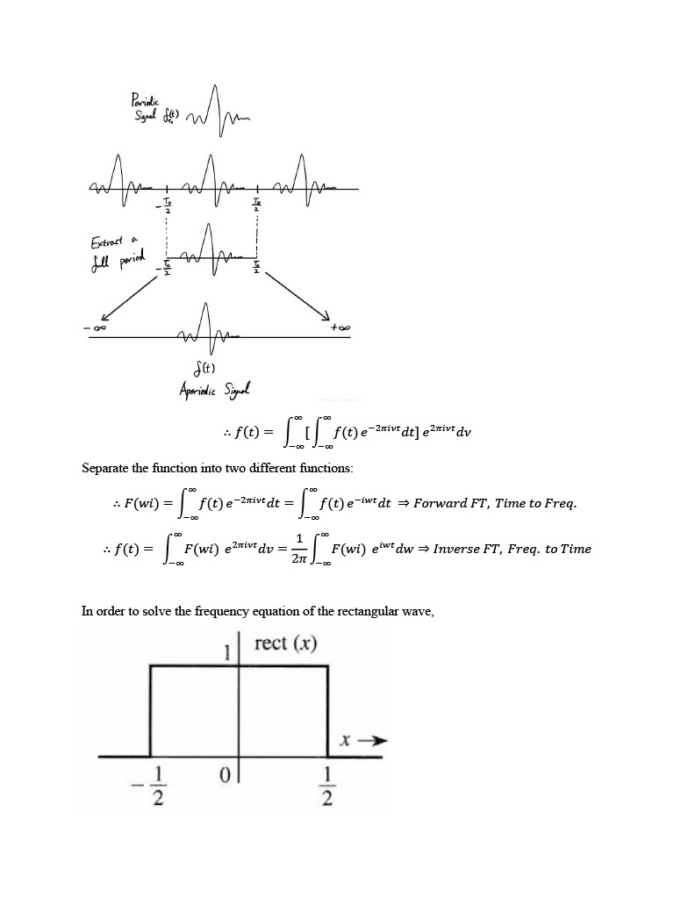

If music is the art of arranging sounds, visualization is the art of portraying their frequencies, generating an animated imagery. The first electronic music visualizer was the Atari Video Music introduced by Atari Inc. in 1976, and designed by the initiator of the home version of Pong, Robert Brown. Compared to its modern counterpart, it was much more expensive and relied on a Hi-Fi stereo system. These days, one can easily build music visualizers if they have popular visualization libraries like p5.js in JavaScript, because they effectively abstract the need for the understanding of pure mathematics behind it. However, though much more complicated, it is not impossible to build them from scratch: from the very basic knowledge of calculus. This project would focus on the derivation of those mathematical equations, known as Fourier Transform, for special waveforms such as triangular and rectangular waves. Then, it would implement them thorugh a DIY JavaScript library, called _lelandoo.js_, which is to be built on top of p5.js.

### Outline
[1. Mathematical Derivation of Fourier Transform](#1-mathematical-derivation-of-fourier-transform)

[2. Implementation on JavaScript](#2-implementation-on-javascript)

[3. Testing the Music Visualizer](#3-testing-the-music-visualizer)

[Conclusion](#conclusion)

&nbsp;

## 1. Mathematical Derivation of Fourier Transform

The following set of equations is the mathematical derivation of Fourier Transform for various waveforms, including triangular and rectangular waves. Calculus knowledge and a basic understanding of quantum waves are required for following the steps of derivation.

The derivation begins with expressing a random function _f_ as a sum of sinusoidal waves (i.e. sine, cosine) with different frequencies. 

These equations were then converted to discrete mathematics forms, allowing for digital binary computations. Having established the mathematical background, a JavaScript library _lelandoo.js_ was created on top of p5.js to facilitate the process of implementing the equations.

&nbsp;

## 2. Implementation on JavaScript

{:.lead width="400" height="400" loading="lazy"}

Logo of _lelandoo.js_
{:.note}

In the JavaScript ecosystem, there is a free 3rd-party library called p5.js, which is designed for graphic visualization and sound analysis in websites. For this project, a new library called _lelandoo.js_ was designed on top of p5.js in order to create a set of functions optimized for implementing the Fourier Transform equations that were previously solved.

The library consists of three files: _lelandoo.js_ (for processing sound files), _lelandoo.sound.js_ (for implementing math equations such as FFT), and _lelandoo.visual.js_ (for creating visual effects on the screen). p5.js is the dependency of this library. All three files of _lelandoo.js_ are accessbible through GitHub, and p5.js can be separately downloaded [here](https://p5js.org/).

&nbsp;

## 3. Testing the Music Visualizer

### Time-Domain Oscilloscope

The first visualizer plots the amplitude of music as a function of times. A unique feature of this visualizer is that it changes frequency and amplitude based on the cursor location. 

<iframe width="560" height="315" src="https://www.youtube.com/embed/QD-MDXlSvqE" title="YouTube video player" frameborder="0" allow="accelerometer; autoplay; clipboard-write; encrypted-media; gyroscope; picture-in-picture" allowfullscreen></iframe>

### Frequency-Domain Spectrum

The second visualizer plots the amplitude of music as a function of frequencies. A unique feature is that it generates a sound with frequency based on the cursor location.

<iframe width="560" height="315" src="https://www.youtube.com/embed/HvGN9dT_yCI" title="YouTube video player" frameborder="0" allow="accelerometer; autoplay; clipboard-write; encrypted-media; gyroscope; picture-in-picture" allowfullscreen></iframe>

### Spectogram

The third visualizer plots the frequency of music as a function of times.

<iframe width="560" height="315" src="https://www.youtube.com/embed/Lp_g5NSXFIc" title="YouTube video player" frameborder="0" allow="accelerometer; autoplay; clipboard-write; encrypted-media; gyroscope; picture-in-picture" allowfullscreen></iframe>

&nbsp;

## Conclusion

Overall, the three music visualizers worked successfully. The source code of these visualizers and lelandoo.js library are available at my GitHub page. The time effeciency of implementing Fourier Transform equations seemed low because most developers would choose to use 3rd party libraries that abstract math functions so that they can avoid using calculus. However, the cost effeciency is definitely high because one can build calculus equations without solely relying on 3rd party libraries. Creating DIY libraries implementing them would allow for greater flexibility over handling more complex or optimal functions for desired purposes.
