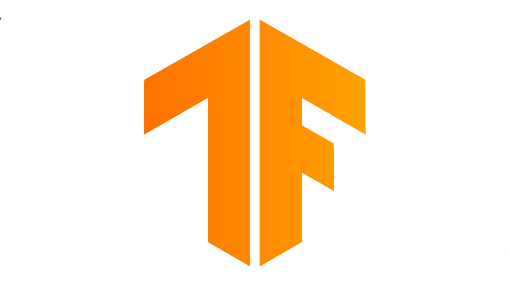

In the era of deep learning, we are lost between two autograd frameworks: Tensorflow and PyTorch. Though tensorflow had been popular for a long time since deep learning was initially popularized, many researchers are moving to PyTorch due to its flexibility and lightness. Plus, considering that the machine learning industry is heavily driven by research, this increasing popularity of PyTorch is noteworthy. Is PyTorch really the game-changer, or is it an overrated hype?

## Tensorflow

{:.lead width="400" height="400" loading="lazy"}

Tensorflow, developed by Google, is an open source deep learning library. Since it has been out for years, Google Brain has released many features that are useful for production, such as Tensorflow Lite for mobile development, and Tensorflow.js for web development. The problem with Tensorflow was its complexity in syntax. The syntax does not follow the natural structure of Python, which often frustrates those who expect the flexibility of Python from Tensorflow. 

### Tensorflow 2.0?

In late 2019, in order to reduce the difficulty of the syntax and make deep learning more accessible in the open-source community, Tensorflow was updated to the 2.0 version with its new frontend API Keras. Unlike classic Tensorflow, Keras provides much easier syntax and functionality, helping developers adapt to the era of deep learning without an essential degree in machine learning. At the same time, developers could enjoy the fast comuptation of Tensorflow backend. Theoretically, it was a perfect framework.

However, there was a critical problem with the "easiness" of the framework. Since most functionality was abstracted into simple keywords, if one is to use advanced deep learning architectures, one had to modify the code by using classic Tensorflow, requiring the knowledge both Tensorflow and Keras. Furthermore, when Tensorflow 2 was first released, the framework was full of unknown errors that are difficult to debug, giving developers a traumatic experience wth it. These days, the reputation has improved from then, but people who tried PyTorch never came back from it.

## PyTorch

{:.lead width="400" height="400" loading="lazy"}

PyTorch is another deep learning library. It was built by Facebook AI Team and provides much more "Pythonic" syntax than Tensorflow. It is relatively less mature and has less production functionalities than Tensorflow, but its popularity is increasing.

The reason is simple: PyTorch is more flexible. There are several reasons why PyTorch is considered more flexible. First, the syntax is much easier and more "Pythonic"-- in resemblance with the Python syntax. Second, researchers in academia love this framework, and considering that machine learning is driven by academia, PyTorch is becoming an option for developers as well. Last but not least, it allows for a dynamic graph, allowing developers to experiment with their models during training unlike in Tensorflow that supports statig graph where every characteristic is fixed when initialized. Though Tensorflow 2 does have a similar feature called "Eager Execution," it is not even close to the level of PyTorch.

## Conclusion

Though I mostly use PyTorch because of its flexibility, both Tensorflow and PyTorch are strong options. People's opinions are being converged to an idea that PyTorch excels at research while Tensorflow excels at production. PyTorch can be better in research because research engineers would need to experiment with different hyperparameters and architectures. But Tensorflow is still a king in the industry, where Tensorflow allows for faster computations and more diverse ways of production.